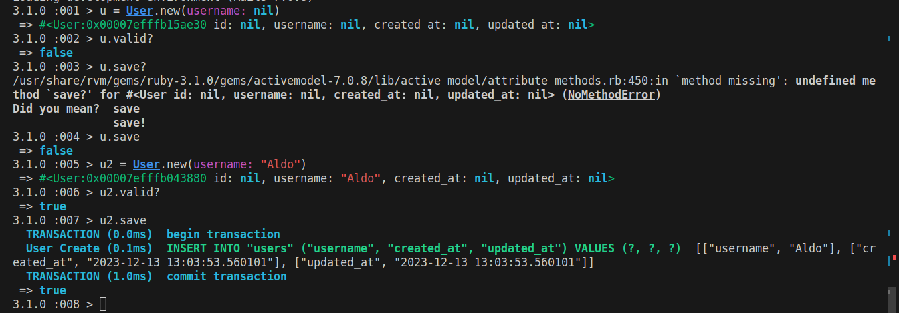
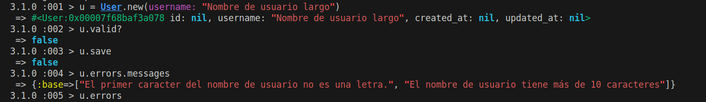
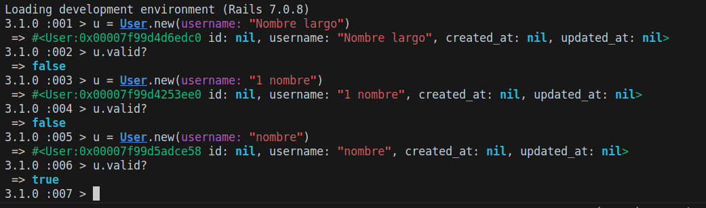
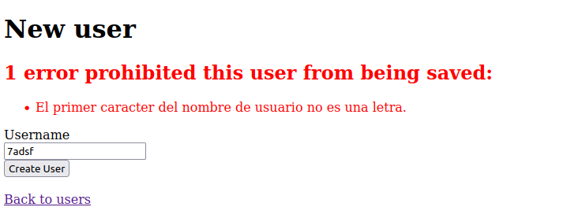
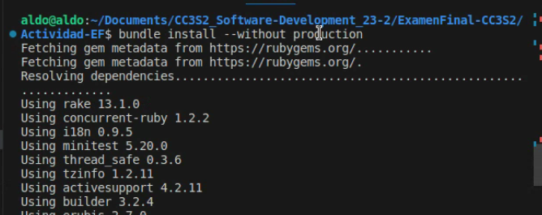
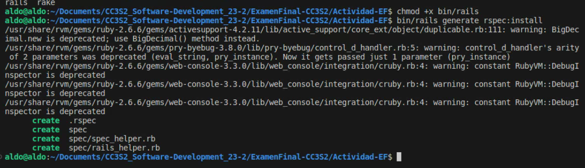
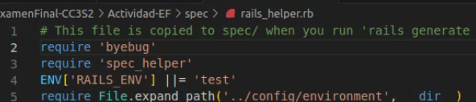
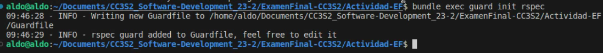
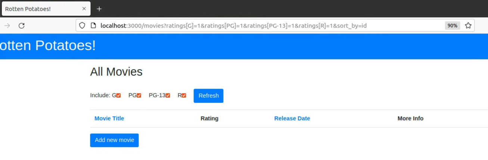

# Examen Final de CC3S2


## Parte 1

### Apartado 1. Git: conflicto de fusión

### Apartado 2. Validaciones del modelo

Tenemos el siguiente modelo User:

```ruby
class User < ActiveRecord::Base
  validates :username, :presence => true
  validate :username_format
end
```

**Pregunta 1**

¿Qué pasa si tenemos @user sin nombre de usuario y llamamos a `@user.valid?`? ¿Qué guardará @user.save?

**Respuesta**

Si al crear nuestra instancia de User dejamos el campo :username como nil, lo que pasa es que la instancia no será almacenada en la base de datos del modelo debido al primer validador, que se interpone entre la instrucción del controlador @user.save y el modelo User para que el objeto no sea persistido si es inválido. La instrucción @user.save guarda el objeto @user.




**Pregunta 2**

Implementa username_format. Para los propósitos, un nombre de usuario comienza 	con una letra y tiene como máximo 10 caracteres de largo. Recuerda, las validaciones personalizadas agregan un mensaje a la colección de errores.

**Respuesta**

Implementación del método:

```ruby
def username_format
    if is_letter(username[0])
        errors.add(:base, "El primer caracter del nombre de usuario no es una letra.")
    end

    if username.length > 10
        errors.add(:base, "El nombre de usuario tiene más de 10 caracteres")
    end
end
private
def is_letter(string)
    string.match(/[[:alpha:]]/).nil?          
end
```



Esta es [la carpeta de la aplicación](./parte1apartado2/) que creamos para probar el código, y este es el código completo:

```ruby
class User < ApplicationRecord
    validates :username, :presence => true
    validate :username_format

    def username_format
        if is_letter(username[0])
            errors.add(:base, "El primer caracter del nombre de usuario no es una letra.")
        end

        if username.length > 10
            errors.add(:base, "El nombre de usuario tiene más de 10 caracteres")
        end
    end
    private
    def is_letter(string)
        string.match(/[[:alpha:]]/).nil?          
    end
end
```

Aquí podemos ver en consola que este validador username_format funciona como se espera:



Y también podemos ver cómo funciona en el navegador:



### Apartado 3. Filtros del controlador

**Pregunta**

Para el modelo de User, digamos que queremos verificar si @user era administrador de todos los métodos en AdminController. Completa el método before_filter:check_admin a continuación que verifica si el campo de administrador en @user es verdadero. De lo contrario, redirija a la página admin_login con un mensaje que indica acceso restringido.

```
```

## Parte 2

Instalamos las gemas, excepto las del entorno de producción:



Volvemos a hacer lo mismo luego de incluir las gemas de Faraday.

Ahora nos aseguramos de que todos los rsepc estén en su lugar:



Agregamos byebug:



Ejecutamos Guard:



Ejecutamos el servidor para verificar que todo está bien:



### Paso 1
