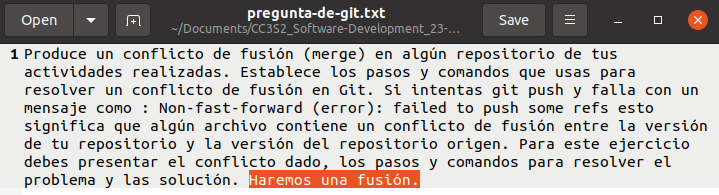

# Examen Final de CC3S2

- [Examen Final de CC3S2](#examen-final-de-cc3s2)
  - [Parte 1](#parte-1)
    - [Apartado 1. Git: conflicto de fusión](#apartado-1-git-conflicto-de-fusión)
    - [Apartado 2. Validaciones del modelo](#apartado-2-validaciones-del-modelo)
    - [Apartado 3. Filtros del controlador](#apartado-3-filtros-del-controlador)
    - [Apartado 4.](#apartado-4)
  - [Parte 2](#parte-2)
    - [Paso 1](#paso-1)


## Parte 1

### Apartado 1. Git: conflicto de fusión

**Conflicto de fusión local**

Primero verificamos la configuración de Git. Como vemos en la siguiente imagen, tenemos el nombre y el email del repositorio definidos, un repositorio remoto establecido y una rama principal.


Luego, creamos [el archivo sobre el que crearemos el conflicto](./parte1apartado1/pregunta-de-git.txt). Tendrá el mismo texto de la pregunta.


Ahora vamos a crear una rama adicional llamada experiment usando git branch. Si nos movemos a esta rama con git checkout, veremos que tenemos toda la información del último commit de la rama principal. En el texto agregaremos la siguiente frase seleccionada con el cursor:


Luego añadimos la modificación del archivo al staging con git add y usamos git commit para guardarla, con un mensaje en el que se especifica la rama desde la que se hace el commit. Todo esto queda registrado en nuestro terminal. (Tuvimos un error de digitación o confusión en el segundo comando "git branch checkout").


Ahora volvemos a la rama main con checkout. Para asegurar el conflicto cuando hagamos la fusión, vamos a modificar la misma línea, como se ve en la siguiente imagen:


Ahora procedemos de manera similar que en la otra rama. Añadimos la modificación al área de preparación con git add y guardamos la modificación en la base de datos del repositorio local con git commit. Y, como antes, el mensaje del commit hará referencia a la rama desde la que se envía.

Aplicamos el git merge para traernos la modificación de la rama experiment hacia la rama main en la que estamos y producimos el conflicto. Esto es lo que vemos en consola hasta este punto:


En VS Code, este conflicto de fusión se representa con colores y funciones integradas que hacen más fácil resolver el conflicto:


Sin embargo, hemos de saber que podemos resolver este conflicto de Git incluso en un simple editor de texto. Esto es lo que vemos en un modesto editor:


Basta con cambiar lo que vemos de forma que se ajuste a lo que queremos. En este caso, no nos convence ninguna de las modificaciones. La modificación se quedará simplemente como: "Haremos una fusión":



Luego de guardar los cambios en el editor, añadimos la modificación que solucionó el conflicto al área de staging. Con git status vemos que git detecta que el conflicto está solucionado y solo necesitamos hacer el commit con git commit (sin necesidad de especificar el mensaje). Cuando hacemos esto, se nos abre un editor de texto interno que nos muestra un mensaje predeterminado para las fusiones. Salimos de aquí y vemos que la fusión ya ha sido realizada. Así hacemos todo esto en la terminal:


**Conflicto de fusión remota**

Ahora vamos a simulat el error Non-fast-forward de fusión remota. Primero hacemos un cambio a nuestro archivo desde la interfaz de GitHub en el repositorio remoto:


Luego, sin usar git pull previamente, realizamos un cambio en el repositorio local:


Añadimos los cambios al área de staging con git add y los guardamos con git commit. El error Non-fast-forward se presenta cuando tratamos de cargar el commit con los cambios en el respositorio remoto con git push:


Si en este punto tratamos de hacer el git pull, tendremos un conflicto:


Vemos que git representa de la misma forma este conflicto. Debemos hacer lo mismo que antes para solucionarlo: elegir cuál de las dos ramas debemos aceptar. Una es la rama main local y la otra es la rama main remota de GitHub. En este caso elegimos la remota. Lo que queda por hacer para resolver el conflicto es agregar el cambio al área de staging y hacer el commit de fusión (merge) de la rama main remota hacia la rama main local. Así lo hacemos en el terminal:


El diagrama de ramas muestra perfectamente la fusión en la rama local:


Y ya podemos hacer git push, superando el error non-fast-forward:


### Apartado 2. Validaciones del modelo

Tenemos el siguiente modelo User:

```ruby
class User < ActiveRecord::Base
  validates :username, :presence => true
  validate :username_format
end
```

**Pregunta 1**

¿Qué pasa si tenemos @user sin nombre de usuario y llamamos a `@user.valid?`? ¿Qué guardará @user.save?

**Respuesta**

Si al crear nuestra instancia de User dejamos el campo :username como nil, lo que pasa es que la instancia no será almacenada en la base de datos del modelo debido al primer validador, que se interpone entre la instrucción del controlador @user.save y el modelo User para que el objeto no sea persistido si es inválido. La instrucción @user.save guarda el objeto @user.


**Pregunta 2**

Implementa username_format. Para los propósitos, un nombre de usuario comienza 	con una letra y tiene como máximo 10 caracteres de largo. Recuerda, las validaciones personalizadas agregan un mensaje a la colección de errores.

**Respuesta**

Implementación del método:

```ruby
def username_format
    if is_letter(username[0])
        errors.add(:base, "El primer caracter del nombre de usuario no es una letra.")
    end

    if username.length > 10
        errors.add(:base, "El nombre de usuario tiene más de 10 caracteres")
    end
end
private
def is_letter(string)
    string.match(/[[:alpha:]]/).nil?          
end
```


Esta es [la carpeta de la aplicación](./parte1apartado2/) que creamos para probar el código, y este es el código completo:

```ruby
class User < ApplicationRecord
    validates :username, :presence => true
    validate :username_format

    def username_format
        if is_letter(username[0])
            errors.add(:base, "El primer caracter del nombre de usuario no es una letra.")
        end

        if username.length > 10
            errors.add(:base, "El nombre de usuario tiene más de 10 caracteres")
        end
    end
    private
    def is_letter(string)
        string.match(/[[:alpha:]]/).nil?          
    end
end
```

Aquí podemos ver en consola que este validador username_format funciona como se espera:


Y también podemos ver cómo funciona en el navegador:


### Apartado 3. Filtros del controlador

**Pregunta**

Para el modelo de User, digamos que queremos verificar si @user era administrador de todos los métodos en AdminController. Completa el método before_filter:check_admin a continuación que verifica si el campo de administrador en @user es verdadero. De lo contrario, redirija a la página admin_login con un mensaje que indica acceso restringido.

```
```

### Apartado 4.

Primero, implementaremos una solicitud AJAX POST utilizando jQuery para enviar los datos del formulario de inicio de sesión. Aquí está el código con los comentarios necesarios:

```javascript
$("#onSubmit").click(function() {
    var username = $('.user').val();
    var password = $('.pass').val();

    $.ajax({
        type: "POST",
        url: "/login",
        data: {
            user: username,
            pass: password
        },
        success: function(response) {
            console.log("Login exitoso:", response);
        },
        error: function(xhr, status, error) {
            console.error("Error en el login:", xhr, status, error);
        }
    });
});
```


## Parte 2

Instalamos las gemas, excepto las del entorno de producción:


Volvemos a hacer lo mismo luego de incluir las gemas de Faraday.

Ahora nos aseguramos de que todos los rsepc estén en su lugar:


Agregamos byebug:


Ejecutamos Guard:


Ejecutamos el servidor para verificar que todo está bien:


### Paso 1
