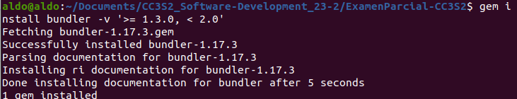
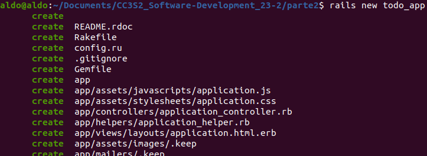
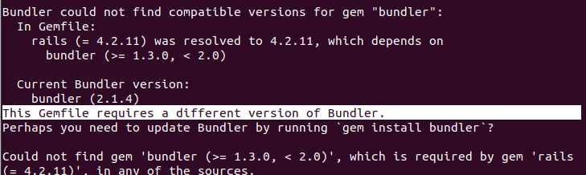
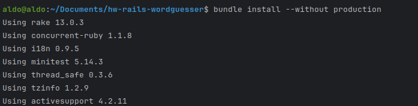
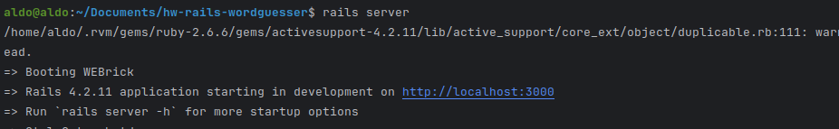
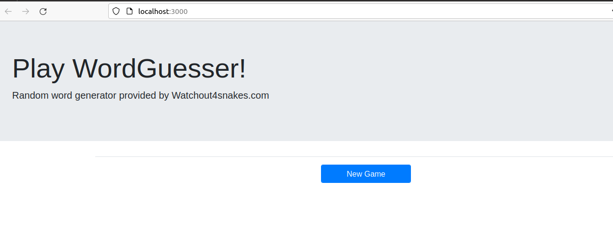
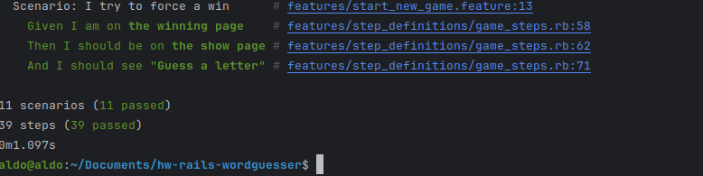

## Parte 2. Rails

Instalamos la versión de bundler que necesitamos:

 

Creamos una nueva aplicación Rails:



Tenemos problemas para correr la versión de bundler que necesitamos:


 


## Parte 3. Ruby on Rails

Luego de clonar el repositorio indicado, ejecutamos el comando `bundle install`:




Iniciamos el servidor Rails con el comando `rails server`:






**Preguntas (1 punto)**

1. ¿Cuál es el objetivo de ejecutar bundle install?

- Lo ejecutamos para asegurarnos de que tenemos todas las gemas del Gemfile y sus dependencias estén instaladas.

2. ¿Por qué es una buena práctica especificar –without production al ejecutarlo en su computadora de desarrollo?(Para la mayoría de las aplicaciones Rails, también tendrías que crear y inicializar la base de datos de desarrollo, pero al igual que la aplicación Sinatra, esta aplicación no utiliza ninguna base de datos).

Porque en el entorno de desarrollo no necesitamos las gemas incluidas para trabajar en el entorno de producción.

**Preguntas (3 puntos)**

 1. ¿En qué parte de la estructura del directorio de la aplicación Rails está el código correspondiente al modelo WordGuesserGame?

- app/models/

1. ¿En qué archivo está el código que más se corresponde con la lógica del archivo app.rb de las aplicaciones Sinatra que maneja las acciones entrantes del usuario?

   - En el archivo game_controller.rb (ruta: app/controllers/game_controller.rb)

2. ¿Qué clase contiene ese código?

   - Ese archivo contiene la clase GameController.

3. ¿De qué otra clase (que es parte del framework Rails) hereda esa clase?

   - GameController hereda de la clase ApplicationController.

4. ¿En qué directorio está el código correspondiente a las vistas de la aplicación Sinatra (new.erb, show.erb, etc.)?

   - app/views/game/

5. Los sufijos de nombre de archivo para estas vistas son diferentes en Rails que en la aplicación Sinatra. ¿Qué información proporciona el sufijo situado más a la derecha del nombre del archivo (por ejemplo: en foobar.abc.xyz, el sufijo .xyz) sobre el contenido del archivo?
   - El sufijo _erb_ es un acrónimo que viene de "Embedded RuBy". Este sufijo le indica a Rails que estos archivos son platillas HTML que contienen insertado código Ruby, y que por tanto tiene que ejecutar este código para añadir dinámicamente contenido a la plantilla.
  
6. ¿Qué información te brinda el otro sufijo sobre lo que se le pide a Rails que haga con el archivo?
   - El otro sufijo es _html_. Como dijimos antes, estos archivos son plnatillas HTML que contienen código Ruby. El sufijo simplmemente indica que el producto final que debe entregar Rails luego de ejecutar el código es una plnatilla HTML.
  
7. ¿En qué archivo está la información de la aplicación Rails que asigna rutas (por ejemplo, GET/new) a las acciones del controlador?
   - Está en el archivo routes.rb (ruta: config/routes.rb)
8. ¿Cuál es el papel de la opción :as => 'name' en las declaraciones de ruta de config/routes.rb?
   - Ese segmento de código le dice q Rails que "name_path" hace referencia a la ruta que se está definiendo antes en la misma línea de código.
   - Por ejemplo, la línea `get  'new'    => 'game#new',   :as => 'new_game'` nos permite usar el manejador _path en new_game_path para hacer referencia a la ruta "/new". Eso de hecho se hace en el controlador *game_controller.rb*.

Preguntas (1 punto)

1. En la versión de Sinatra, los bloques before do...end y after do...end se utilizan para la gestión de sesiones. ¿Cuál es el equivalente más cercano en esta aplicación Rails y en qué archivo encontramos el código que lo hace?
    - El equivalente está en el controlador game_controller.rb, en las líneas 3 y 4: 
       ```ruby
        before_action :get_game_from_session
        after_action  :store_game_in_session 
        ```

2. Un formato de serialización popular para intercambiar datos entre aplicaciones web es JSON. ¿Por qué no funcionaría utilizar JSON en lugar de YAML? (Reemplaza YAML.load() con JSON.parse() y .to_yaml con .to_json para realizar esta prueba. Tendrás que borrar las cookies asociadas con localhost:3000 o reiniciar tu navegador con un nuevo Incognito/ Ventana de navegación privada, para borrar la sesión[]. Según los mensajes de error que recibe al intentar utilizar la serialización JSON, debería poder explicar por qué la serialización YAML funciona en este caso pero JSON no). 
    - 

**Preguntas (2 puntos)**

1. En la versión de Sinatra, cada acción del controlador termina con redirect (que, como puedes ver, se convierte en redirección_to en Rails) para redirigir al jugador a otra acción, o con erb para representar una vista. ¿Por qué no hay llamadas explícitas correspondientes a erb en la versión Rails?
    - Porque Rails está hecho de tal manera que supone cuándo se hace referencia a los archivos de extensión erb.
  
2. En la versión de Sinatra, codificamos directamente un formulario HTML usando la etiqueta <form>, mientras que en la versión de Rails usamos un método Rails form_tag, aunque sería perfectamente legal usar etiquetas HTML <form> sin formato en Rails. ¿Se te ocurre alguna razón por la que Rails podría introducir este "nivel de direccionamiento indirecto"?
    - Porque de esa forma puede direccionar a rutas usando las referencias definidas en _routes.rb_ con el método as.
  
3. ¿Cómo se manejan los elementos del formulario, como campos de texto y botones, en Rails? (Nuevamente, el HTML sin formato sería legal, pero ¿cuál es la motivación detrás de la forma en que Rails lo hace?)
    - La motivación es que así ayudamos a Rails a hacer sus suposiciones, y esto hace que necesitemos escribir menos código.
  
4.  En la versión de Sinatra, las vistas de show, win y lose reutilizan el código en la vista new que ofrece un botón para iniciar un nuevo juego. ¿Qué mecanismo de Rails permite reutilizar esas vistas en la versión de Rails?
    - En las vistas show, win, y lose tenemos una línea al final que permite esta reutilización: `<%= render :template => 'game/new' %>`.

Corremos el comando `rake cucumber /features` para ejecutar todas las pruebas de integración en el directorio /features y observamos que todas pasan:



Verifique la ejecución de los escenarios Cucumber y páselos ejecutando rake cucumber.

**Pregunta**

1. ¿Cuál es una explicación cualitativa de por qué no fue necesario modificar los escenarios de Cucumber y las definiciones de pasos para que funcionaran igualmente bien con las versiones de la aplicación Sinatra o Rails? (1 punto)

      - Porque las pruebas de integración están bien formuladas. Rails y Sinatra cumplen una función principal: el enrutamiento. Rails da estructura al código de nuestra aplicación al darnos el patrón MVC, pero no cambia su contenido lógico. Sin embargo, las pruebas no prueban más que los módulos de nuestro programa y su interacción. Las mismas pruebas siguen pasando porque el contenido de nuestra aplicación no ha cambiado.
