# Examen Sustitutorio <!-- omit in toc -->

- [Parte 1](#parte-1)
  - [Preparamos RottenPottatoes](#preparamos-rottenpottatoes)
  - [Creamos el nuevo campo "director"](#creamos-el-nuevo-campo-director)
  - [Modificamos las vistas](#modificamos-las-vistas)
- [Parte 2](#parte-2)
- [Parte 3](#parte-3)
- [Parte 4. RSpec y pruebas](#parte-4-rspec-y-pruebas)


## Parte 1

### Preparamos RottenPottatoes

Usamos bundle install para instalar las gemas definidas en el Gemfile y sus dependencias. Toda la aplicación se encuentra en la carpeta [Actividad-ES](./Actividad-ES/). El comando específico usado:

```bash
bundle install --without production
```

El modificador del comando impidió que se instalaran gemas de producción, como bien se registra en los comentarios de la ejecución del comando: "Gems in the group production were not installed".

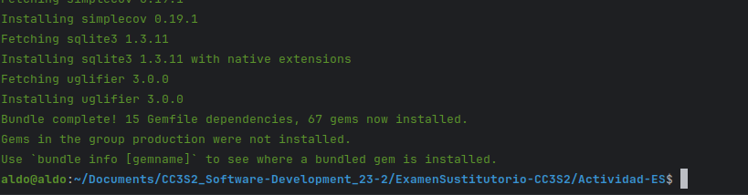

Verificamos que las gemas rspec y cucumber de este proyecto, especificadas en el Gemfile, funcionan correctamente:

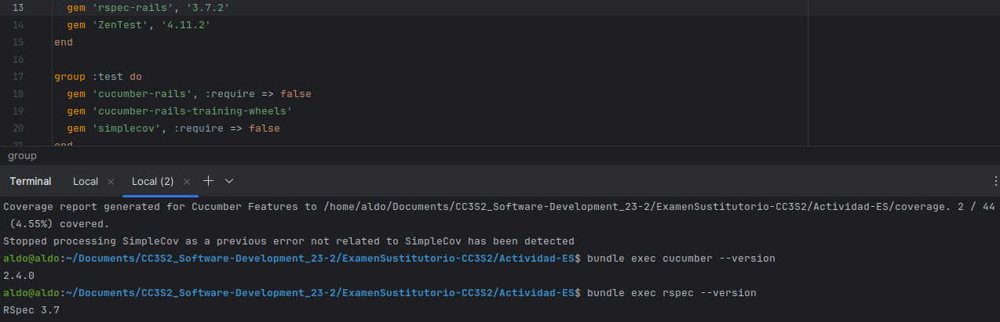

Corremos la migración pendiente:

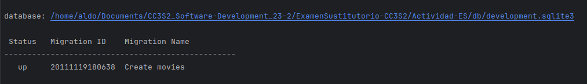

Adicionalmente usamos usamos las semillas con bundle exec rails db:seed

Levantamos el servidor y vemos que la aplicación funciona como debería antes de hacerle cambios:

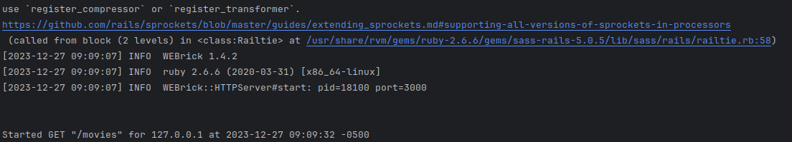

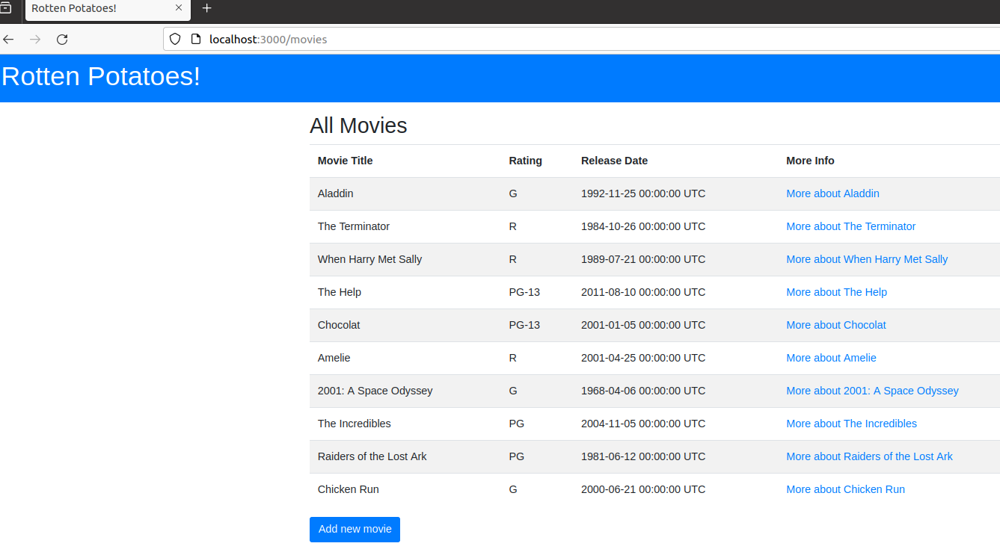


### Creamos el nuevo campo "director"

Añadimos la columna requerida mediante una migración especial usando el comando rails generate:

```bash
bundle exec rails generate migration add_director_to_movies director:string
```

Este comando genera automáticamente el siguiente código:

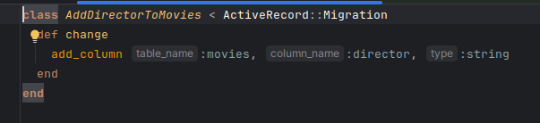

Para ejecutar esta nueva migración usamos el comando sugerido en la actividad:

```bash
bundle exec rake db:test:prepare
```

Automáticamente agrega el campo director al esquema:

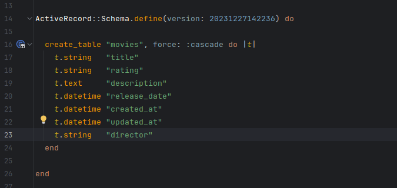

### Modificamos las vistas

Vemos los pasos en movies_step.rb y pensamos que ya se pueden pasar los pasos Given porque todo lo que tenemos que hacer es crear nuevas instancias de Movie que tengan todos los campos, incluido el de director, lo cual ahora es posible gracias a la última migración en la que se añadió esta columna.

Corremos el comando bundle exec cucumber y vemos que solo tres pasos pasan como esperabamos, los cuales corresponden a los pasos Given (en Background para evitar redundancia) como esperabamos:

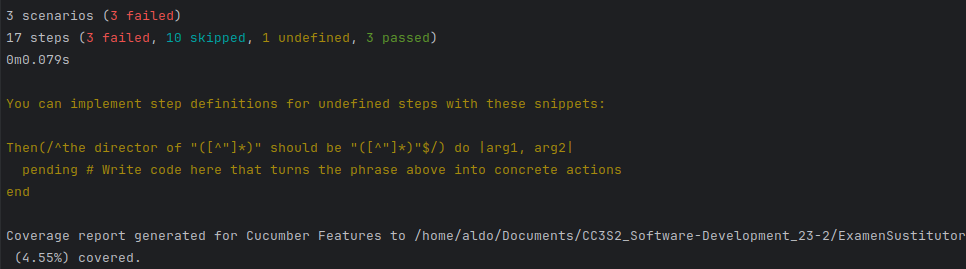


Modificamos la vista de edición de una película en edit.html.erb para que se pueda modificar el campo director:

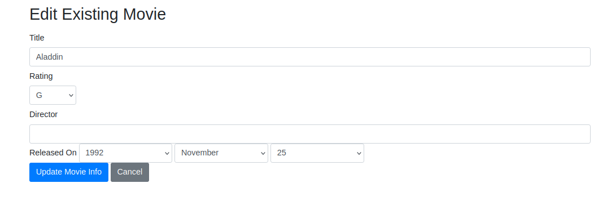

Modificamos el archivo env.rb para asegurarnos de que tenemos configurado el entorno correcto para Cucumber (el entorno de prueba):

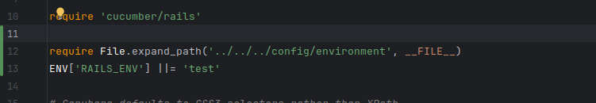

Tenemos errores que indican que faltan mapeos de rutas en paths.rb para las páginas de detalles de "Star Wars" y "Alien". Necesitamos agregar estas rutas al archivo paths.rb.


Pasamos tres pruebas más:

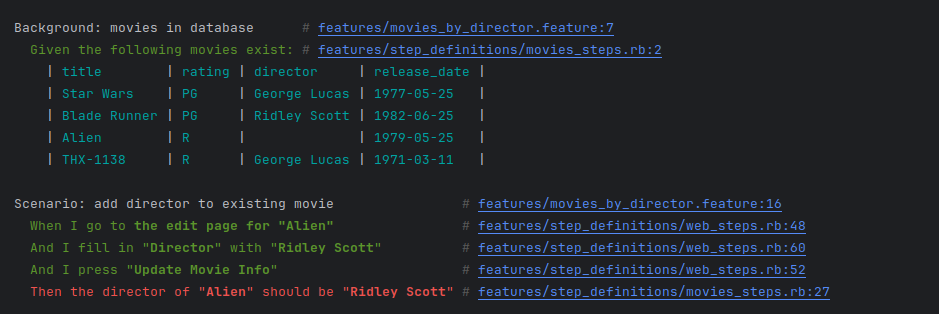


Solo nos falta el paso Then.

## Parte 2

**¿Por qué la abstracción de un objeto de formulario pertenece a la capa de presentación?**  

   La abstracción de un objeto de formulario está en la capa de presentación porque interactúa directamente con la interfaz de usuario, facilitando la entrada y presentación de datos. Esta capa es responsable de cómo se muestran los datos a los usuarios y cómo se recopilan sus entradas, separando así estas funciones de la lógica de negocios y la manipulación de datos.

**¿Cuál es la diferencia entre autenticación y autorización?**  

   La autenticación es el proceso de verificar la identidad de un usuario, típicamente mediante un nombre de usuario y contraseña. En cambio, la autorización determina qué permisos tiene un usuario autenticado en el sistema, es decir, a qué recursos puede acceder y qué acciones puede realizar.

**¿Cómo funcionan los middlewares en Ruby on Rails y qué sucede si se omiten?**  

   Los middlewares en Ruby on Rails son componentes que se sitúan entre el servidor web y la aplicación, procesando las solicitudes entrantes en una secuencia definida. Si se omiten middlewares clave, podría afectarse la funcionalidad de la aplicación, como problemas en la gestión de sesiones, seguridad, o rendimiento de las solicitudes.

**¿Cómo se identifica y aborda un 'God object' en Active Record?**  

   Un 'God object' en Active Record es una clase que asume demasiadas responsabilidades, lo que lleva a un código difícil de mantener y testear. Se identifica por tener un alto número de líneas de código, métodos, y conexiones con otras clases. Para abordarlo, se recomienda la refactorización, dividiendo sus responsabilidades en clases más pequeñas y enfocadas, mejorando así la mantenibilidad y claridad del código.

## Parte 3


## Parte 4. RSpec y pruebas

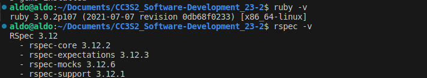

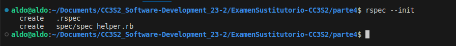