# Actividad: Uso de JUnit5 y RSpec <!-- omit in toc -->

## Tutorial de JUnit5

Enlazo [los archivos creados en este apartado](./junit_tutorial/) según [el tutorial](https://www.digitalocean.com/community/tutorials/junit5-tutorial).

Configurando el *pom.xml* para poder usar JUnit5:

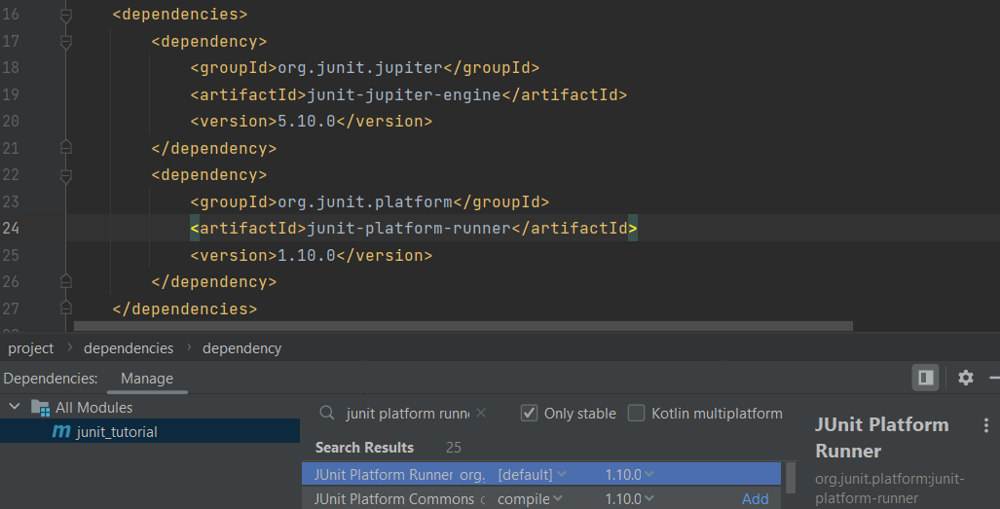

Usando las anotaciones de JUnit:

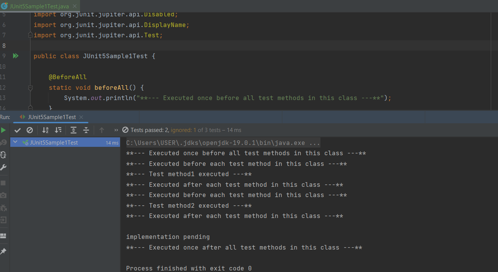

Usando las aserciones de la librería de JUnit5:

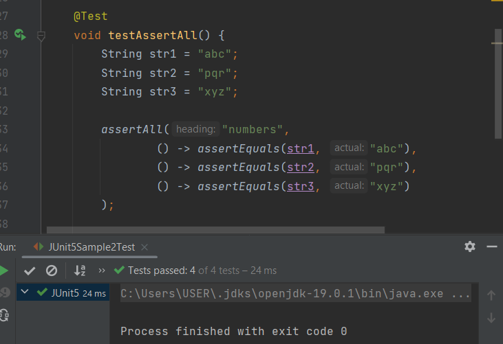

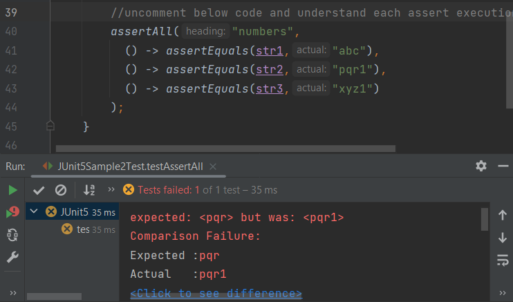

Cómo importar las anotaciones y aserciones:

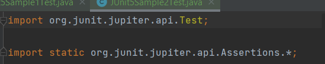

Uso de JUnit5 Assumptions:

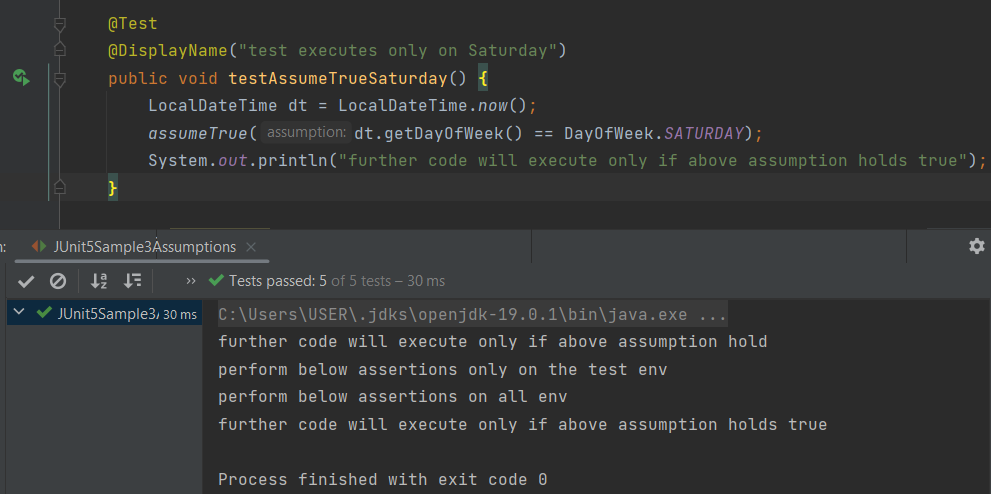

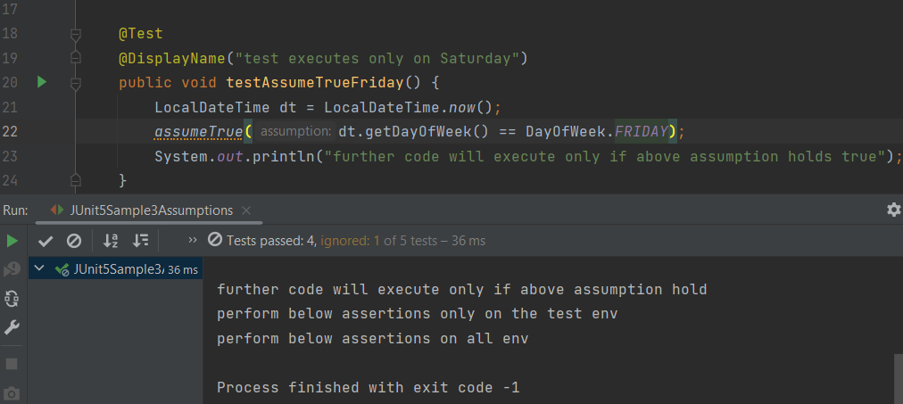

La anotación Nested:

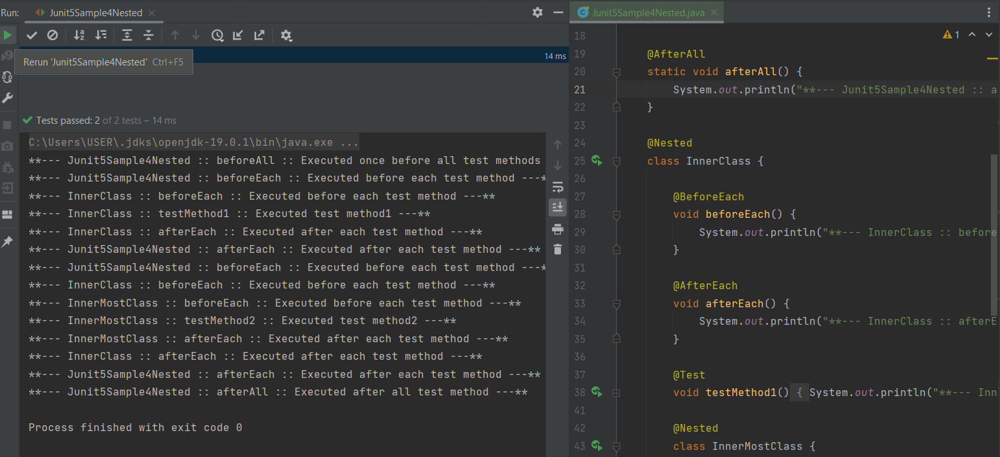

## RSpec

A partir de aquí seguimos con el [tutorial de introducción a RSpec]() y creamos [estos archivos](./BDD%20with%20RSpec/)

Obtenemos un error porque el método no está definido:

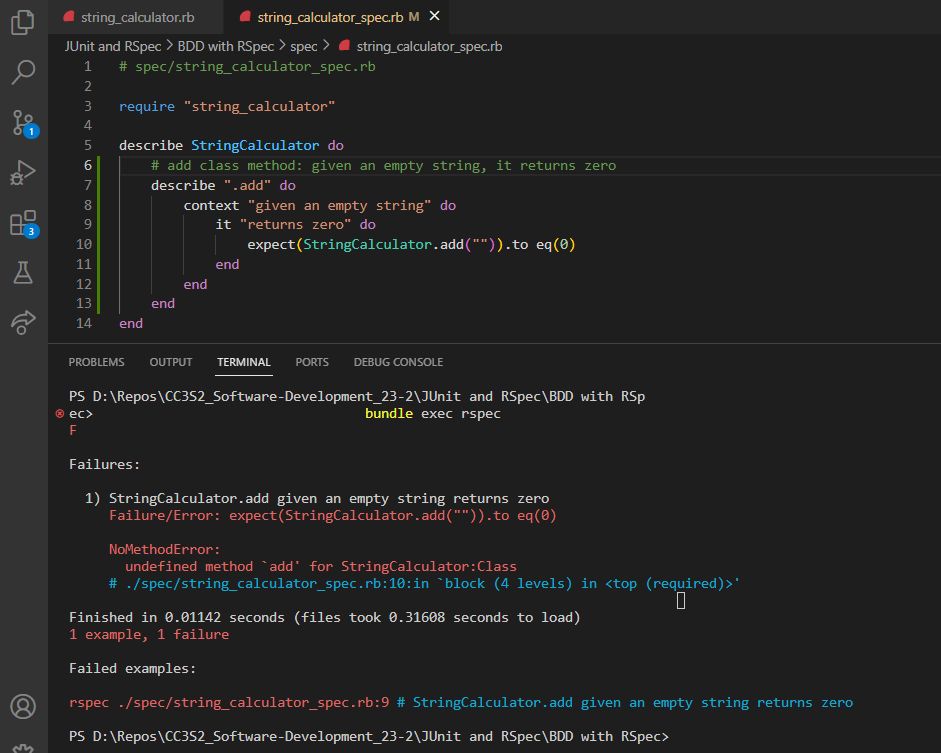

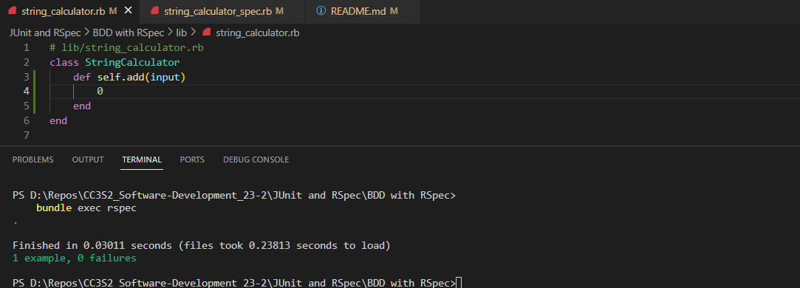

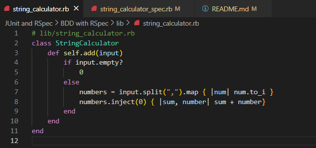

Ahora vamos a imprimir los resultados de las pruebas en un nuevo formato con el comando

```bash
bundle exec rspec --format documentation
```

Este formato resulta muy cómodo para visualizar rápidamente los problemas de nuestro código:

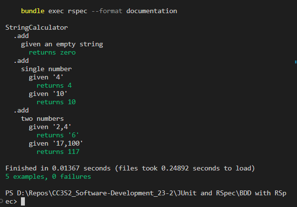

## De RSpec a JUnit5

Para esta parte creamos un [nuevo proyecto en IntelliJ](./rspec_to_junit/).

Siguiendo la metodología de rojo a verde, primero creamos la prueba más simple que evalúa si el método retorna cero cuando recibe la cadena vacía. La prueba falla porque ni siquiera hemos definido el método `add()`:

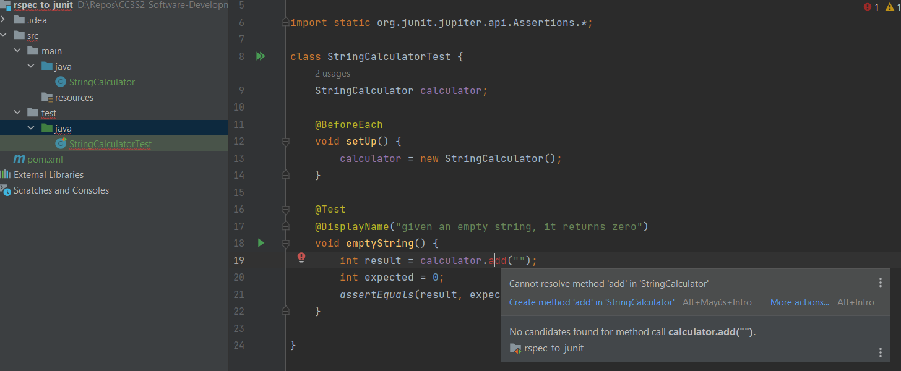

Resulto eso, la prueba pasa:

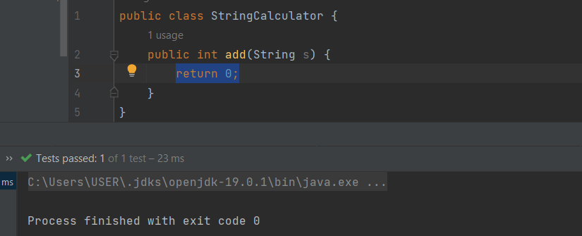

Codificamos otro requerimiento de nuestro método en forma de prueba: dada una cadena con un solo número, el método debe retornar el valor del número. Para esta prueba usamos la parametrización. Vemos que esta prueba no pasa:

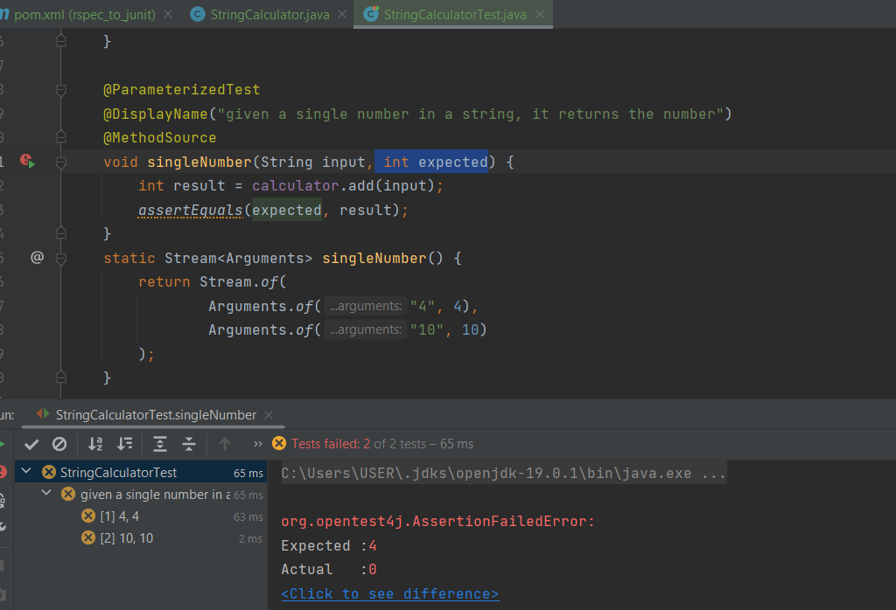

La siguiente implementación pasa las pruebas:

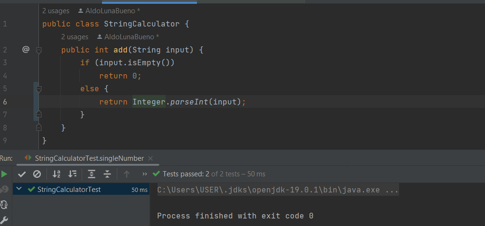

Ahora codificamos en forma de prueba unitaria el último requerimiento de este ejemplo: dada una cadena con dos números separados por coma, retornar la suma de los valores de los números. La prueba falla: 

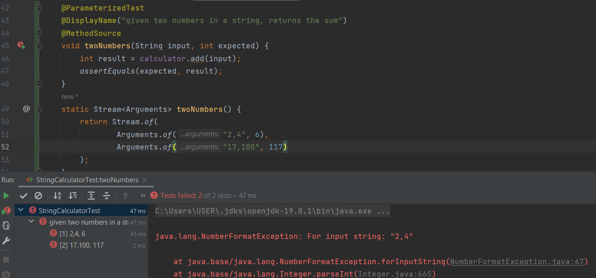

Y nuestra nueva implementación, que ya se va volviendo más elaborada, pasa todas las pruebas que teníamos hasta el momento, por lo que estamos seguros de que cumple todos los requerimientos:

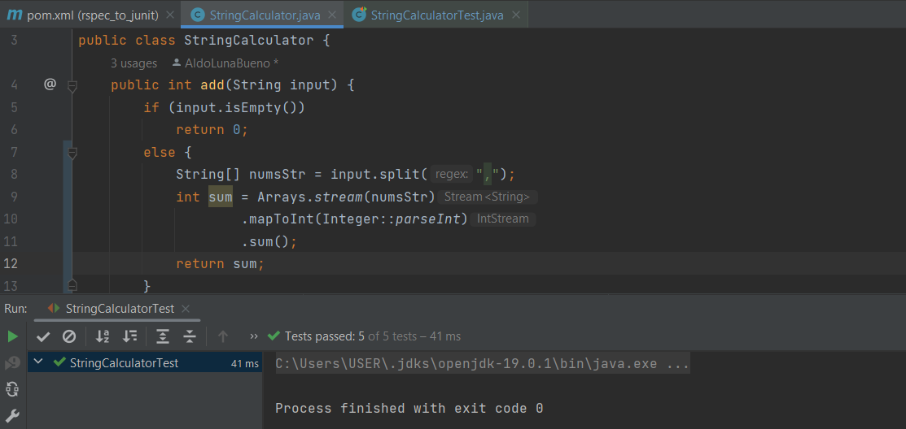