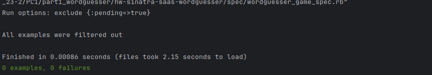

# Práctica Calificada N.º 1 <!-- omit in toc -->

## Parte 0

### Ejecutar Bundler

Aquí tenemos nuestros archivos Gemfile y Gemfile.lock antes de ejectuar el comando `bundle`. 


Para ejecutarlo, nos apoyamos del gestionardor de versiones de Ruby RVM:

```bash
$ bundle
# Your Ruby version is 2.7.0, but your Gemfile specified 2.6.6
$ source ~/.rvm/scripts/rvm
$ bundle
# ... (Gem::GemNotFoundException)
# To install the missing version, run `gem install bundler:2.1.4`
$ gem install bundler:2.1.4
# ... 1 gem installed
$ bundle
# ... Bundle complete! 1 Gemfile dependency, 7 gems now installed.
```

El Gemfile.lock cambió:


**Pregunta.** ¿Cuál es la diferencia entre la finalidad y el contenido de Gemfile y Gemfile.lock? ¿Qué archivo se necesita para reproducir completamente las gemas del entorno de desarrollo en el entorno de producción?

**Respuesta.** El archivo Gemfile especifica las gemas que necesitas (p. e. gem 'sqlite3') y, en algunos casos, las restricciones sobre qué versión(es) son aceptables (p. e. gem 'puma', '>= 1.2', '< 2.0'). Gemfile.lock registra las versiones reales encontradas, no solo de las gemas que especificaste explícitamente, sino también de cualquier otra gema de la que dependen, por lo que es el archivo utilizado por tu entorno de producción para reproducir las gemas disponibles en tu entorno de desarrollo.

**Pregunta.** Después de ejecutar bundle, ¿por qué hay gemas listadas en Gemfile.lock que no estaban listadas en Gemfile?

**Respuesta.** Porque esas otras gemas que no están en el Gemfile son gemas de las que dependen las gemas que sí están en el Gemfile. Son el resultado de la búsqueda recursiva que hace Bundler para que a ninguna gema le falte una gema de la que aquella depende. En el Gemfile.lock la identación nos indica las gemas usadas por otras gemas. Por ejemplo, ni Rack ni Tilt figuran en el Gemfile, pero el Gemfile.lock indica que Sinatra usa las gemas Rack y Tilt como dependencias.


### Crea una sencilla aplicación SaaS con Sinatra

Ejecutamos nuestra aplicación, y se instancia un servidor de aplicación que escucha a través del puerto 4567:


Pero tenemos un problema con el servidor:


El problema es que no hemos creado el archivo config.ru para configurarlo:


Con esta configuración ahora el servidor de aplicación ya se puede conectar a nuestra aplicación y mostrar el breve contenido HTML de saludo en el método `get /` de nuestra app. Sol oejecutamos el siguiente comando:

```bash
bundle exec rackup --port 3000
```


**Pregunta.** ¿Cuáles dos pasos hemos dado antes para garantizar que la librería Sinatra está disponible para cargar en la línea 1?

**Respuesta** Hemos incluido la línea `gem 'sinatra'...` y luego ejecutamos el comando `bundle` para asegurarnos de que la gema está instalada.

**Pregunta.** ¿Qué ocurre si intentas visitar una URL no raíz como https://localhost:3000/hello y por qué? (su URL raíz variará)

**Respuesta.** Nos sale el mismo error de antes, pero esta vez es porque no tenemos una ruta para el método `get /hola` .


### Modifica la aplicación

Modificamos la aplicación para que muestre el texto _Goodbye World_, pero al recargar la página que nos conecta con el servidor local, seguimos viendo lo mismo. Para verlos cambios tenemos que detener el servidor con Ctrl+C y volverlo a correr con `bundle exec rackup --port 3000`:


Ahora sí vemos los cambios:


### Despliega en Heroku

## Parte 1


Corremos `bundle exec autotest`



