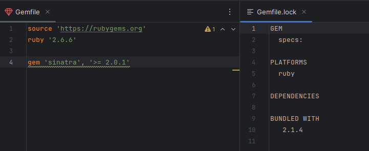

# Práctica Calificada N.º 1 <!-- omit in toc -->

- [Para revisión del profesor](#para-revisión-del-profesor)
- [Introducción](#introducción)
  - [Ejecutar Bundler](#ejecutar-bundler)
  - [Crea una sencilla aplicación SaaS con Sinatra](#crea-una-sencilla-aplicación-saas-con-sinatra)
  - [Modifica la aplicación](#modifica-la-aplicación)
  - [Despliega en Heroku](#despliega-en-heroku)
- [Parte 1](#parte-1)
  - [Desarrollando Wordguesser usando TDD y Guard](#desarrollando-wordguesser-usando-tdd-y-guard)
  - [Tip de depuración](#tip-de-depuración)
- [Parte 2:](#parte-2)
  - [El juego como recurso RESTful](#el-juego-como-recurso-restful)
  - [Asignación de rutas de recursos a solicitudes HTTP](#asignación-de-rutas-de-recursos-a-solicitudes-http)
- [Parte 3: Conexión de WordGuesserGame a Sinatra](#parte-3-conexión-de-wordguessergame-a-sinatra)
  - [La sesión](#la-sesión)
  - [Ejecutando la aplicación Sinatra](#ejecutando-la-aplicación-sinatra)
- [Parte 4. Cucumber](#parte-4-cucumber)
  - [Desarrollar el escenario para adivinar una letra](#desarrollar-el-escenario-para-adivinar-una-letra)
- [Parte 5: Otros casos](#parte-5-otros-casos)

## Para revisión del profesor

1. Integrantes del grupo:
   > Miguel Vega y Aldo Luna

2. Todos los grupos deben presentar un video (no hay tiempo límite) donde expliquen claramente cada una de las secciones de la evaluación, además de un informe en pdf (no se admiten archivos de otros tipo) de sus respuestas:

    > - [Videos explicativos en orden temático](https://drive.google.com/drive/folders/1mgccdeEDmOI-qe5lK_isubp48rdxzV7o?usp=sharing)
    > - [informe en PDF](./sources/PC1.pdf).f

3. Esta práctica es sobre 17 se va a tomar en cuenta las tareas Hola Ruby y JUnit 5 y Rspec:
   
    > [JUnit 5 y RSpec](/JUnit%20and%20RSpec/)


## Introducción

### Ejecutar Bundler

Aquí tenemos nuestros archivos Gemfile y Gemfile.lock antes de ejectuar el comando `bundle`. 



Para ejecutarlo, nos apoyamos del gestionardor de versiones de Ruby RVM:

```bash
$ bundle
# Your Ruby version is 2.7.0, but your Gemfile specified 2.6.6
$ source ~/.rvm/scripts/rvm
$ bundle
# ... (Gem::GemNotFoundException)
# To install the missing version, run `gem install bundler:2.1.4`
$ gem install bundler:2.1.4
# ... 1 gem installed
$ bundle
# ... Bundle complete! 1 Gemfile dependency, 7 gems now installed.
```

El Gemfile.lock cambió:


**Pregunta.** ¿Cuál es la diferencia entre la finalidad y el contenido de Gemfile y Gemfile.lock? ¿Qué archivo se necesita para reproducir completamente las gemas del entorno de desarrollo en el entorno de producción?

**Respuesta.** El archivo Gemfile especifica las gemas que necesitas (p. e. gem 'sqlite3') y, en algunos casos, las restricciones sobre qué versión(es) son aceptables (p. e. gem 'puma', '>= 1.2', '< 2.0'). Gemfile.lock registra las versiones reales encontradas, no solo de las gemas que especificaste explícitamente, sino también de cualquier otra gema de la que dependen, por lo que es el archivo utilizado por tu entorno de producción para reproducir las gemas disponibles en tu entorno de desarrollo.

**Pregunta.** Después de ejecutar bundle, ¿por qué hay gemas listadas en Gemfile.lock que no estaban listadas en Gemfile?

**Respuesta.** Porque esas otras gemas que no están en el Gemfile son gemas de las que dependen las gemas que sí están en el Gemfile. Son el resultado de la búsqueda recursiva que hace Bundler para que a ninguna gema le falte una gema de la que aquella depende. En el Gemfile.lock la identación nos indica las gemas usadas por otras gemas. Por ejemplo, ni Rack ni Tilt figuran en el Gemfile, pero el Gemfile.lock indica que Sinatra usa las gemas Rack y Tilt como dependencias.


### Crea una sencilla aplicación SaaS con Sinatra

Ejecutamos nuestra aplicación, y se instancia un servidor de aplicación que escucha a través del puerto 4567:


Pero tenemos un problema con el servidor:


El problema es que no hemos creado el archivo config.ru para configurarlo:


Con esta configuración ahora el servidor de aplicación ya se puede conectar a nuestra aplicación y mostrar el breve contenido HTML de saludo en el método `get /` de nuestra app. Sol oejecutamos el siguiente comando:

```bash
bundle exec rackup --port 3000
```


**Pregunta.** ¿Cuáles dos pasos hemos dado antes para garantizar que la librería Sinatra está disponible para cargar en la línea 1?

**Respuesta** Hemos incluido la línea `gem 'sinatra'...` y luego ejecutamos el comando `bundle` para asegurarnos de que la gema está instalada.

**Pregunta.** ¿Qué ocurre si intentas visitar una URL no raíz como https://localhost:3000/hello y por qué? (su URL raíz variará)

**Respuesta.** Nos sale el mismo error de antes, pero esta vez es porque no tenemos una ruta para el método `get /hola` .


### Modifica la aplicación

Modificamos la aplicación para que muestre el texto _Goodbye World_, pero al recargar la página que nos conecta con el servidor local, seguimos viendo lo mismo. Para verlos cambios tenemos que detener el servidor con Ctrl+C y volverlo a correr con `bundle exec rackup --port 3000`:


Ahora sí vemos los cambios:


### Despliega en Heroku

## Parte 1

### Desarrollando Wordguesser usando TDD y Guard


Corremos `bundle exec autotest`


Eliminamos el segmento `, :pending => true` de la línea 12...


... y, como Rubymine está configurado con la opción de autosave, vemos inmediatamente que autotest detecta que hay una prueba y que falla:


**Pregunta.** Según nuestros casos de prueba, ¿cuántos argumentos espera el constructor de la clase del juego y, por tanto, qué aspecto tendrá la primera línea de la definición del método que debes añadir a *wordguesser_game.rb*?

**Respuesta.** El constructor espera solo un argumento (en este caso "glorp"). Cuando tratamos de pasar argumentos al método `new` para crear un nuevo objeto a partir de una clase, debemos definir un método en dicha clase llamado `initialize` al cual le pasemos los argumentos. Por eso la primera línea será `def inicialize(word)`.

**Pregunta.** Según las pruebas de este bloque de `describe`, ¿qué variables de instancia se espera que tenga un WordGuesserGame?

**Respuesta.** Se espera que un objeto WordGuesserGame tenga las varibles de instancia `@word`, `@guesses` y `@wrong_guesses`, de las cuales Rubymine solo detecta la existencia de una: `@word`.


### Tip de depuración


## Parte 2: 

**Pregunta.** Enumera el mínimo estado del juego que debe mantenerse durante una partida de Wordguesser.

**Respuesta.** La palabra secreta, la lista de letras que han sido adivinadas correctamente y la lista de letras que han sido adivinadas incorrectamente. Estos componentes del estado del juego ya están codificados como variables de instancia de la clase WordGuesserGame, con lo cual esta clase encapsula el estado.

### El juego como recurso RESTful

**Pregunta.** Enumera las acciones del jugador que podrían provocar cambios en el estado del juego.

**Respuesta.** Hay dos acciones que pueden cambiar el estado del juego: adivinar una letra y empezar una nueva partida. Adivinar una letra o bien modifica la lista de letras adivinandas correcta o incorrectamente, o bien resulta en ganar o perder el juego. Por su parte, empezar una nueva partida desencadena la elección de una nueva palabra secreta y vacía las listas de letras adivinadas correcta e incorrectamente.


### Asignación de rutas de recursos a solicitudes HTTP

**Pregunta.** Para un buen diseño RESTful, ¿cuáles de las operaciones del recurso deben ser manejadas por HTTP GET y cuáles por HTTP POST?

**Respuesta.** Las operaciones manejadas con GET no deberían tener efectos secundarios en el recurso, así que mostrar puede ser manejado por un GET, pero crear y adivinar (que modifican el estado del juego) deberían usar POST. (De hecho, en una verdadera arquitectura orientada a servicios también podemos optar por utilizar otros verbos HTTP como PUT y DELETE, pero no cubriremos eso en esta tarea).

**Pregunta.** ¿Por qué es conveniente que la nueva acción utilice GET en lugar de POST?

**Respuesta.** La nueva acción no provoca por sí misma ningún cambio de estado: sólo devuelve un formulario que el jugador puede enviar.


**Pregunta.** Explique por qué la acción GET /nuevo no sería necesaria si su juego Wordguesser fuera llamado como un servicio en una verdadera arquitectura orientada a servicios.

**Respuesta.** En una verdadera SOA, el servicio que llama a Wordguesser puede generar una petición HTTP POST directamente. La única razón para la nueva acción es proporcionar al usuario humano de la Web una forma de generar esa solicitud.


## Parte 3: Conexión de WordGuesserGame a Sinatra

**Pregunta.** ¿@game en este contexto es una variable de instancia de qué clase? 

**Respuesta.** Es importante tener en cuenta que, en este contexto particular, la variable de instancia "@game" está asociada con la clase WordGuesserApp, que se encuentra en el archivo app.rb. Puede ser un poco difícil de discernir porque estamos tratando con dos clases Ruby separadas aquí. Una de ellas es WordGuesserGame, responsable de encapsular la lógica central del juego. Por otro lado, WordGuesserApp gestiona la lógica necesaria para ofrecer el juego como una aplicación Software as a Service (SaaS). Esencialmente, se puede pensar en WordGuesserApp como un controlador que abarca la lógica y la capacidad de renderizar vistas utilizando erb.

### La sesión

**Pregunta.** ¿Por qué esto ahorra trabajo en comparación con simplemente almacenar esos mensajes en el hash de sesion []?

**Respuesta:** La diferencia de funcionalidad proviene de la duración de la persistencia de los datos. Cuando almacenamos algo en el hash session[], permanece allí hasta que decidimos eliminarlo manualmente. Esto es apropiado cuando los datos necesitan persistir a través de múltiples peticiones. Sin embargo, si la intención es mostrar un mensaje solo una vez, especialmente después de una redirección, el hash flash[] de la gema sinatra-flash proporciona una clara ventaja. No solo retiene el mensaje para la petición en curso, sino que también lo elimina automáticamente después de la siguiente petición, que suele ser una redirección. Este comportamiento se adapta a situaciones en las que se requieren mensajes de corta duración, asegurando que se muestran precisamente cuando se necesitan y se borran rápidamente de la memoria.

### Ejecutando la aplicación Sinatra

**Pregunta.** Según el resultado de ejecutar este comando, ¿cuál es la URL completa que debes visitar para visitar la página New Game?

**Respuesta.** Para acceder a la página New Game, se necesita usar la URL http://localhost:3000/new, ya que la sección de código Ruby en app.rb marcada por get '/new' do... es responsable de renderizar esta página específica.

**Pregunta.** ¿Dónde está el código HTML de esta página?

**Respuesta.** El código HTML de la página New Game se encuentra en el archivo views/new.erb. Es un archivo que se procesa en HTML a través de la directiva erb :new, permitiendo la correcta visualización de la página.

## Parte 4. Cucumber

**Pregunta.** Lea la sección sobre " Using Capybara with Cucumber”  en la página de inicio de Capybara. ¿Qué pasos utiliza Capybara para simular el servidor como lo haría un navegador? ¿Qué pasos utiliza Capybara para inspeccionar la respuesta de la aplicación al estímulo?

**Respuesta.** Las definiciones de pasos que emplean métodos como visit, click_button y fill_in simulan activamente el comportamiento de un navegador visitando páginas web, interactuando con formularios y pulsando botones, tal y como lo haría un usuario. Por otro lado, las definiciones de pasos que utilizan have_content inspeccionan la respuesta de la aplicación buscando contenido específico en las páginas HTML servidas.

**Pregunta.** Mirando features/guess.feature, ¿cuál es la función de las tres líneas que siguen al encabezado "Feature:"?
Respuesta: Las tres líneas que siguen al título "Feature:" sirven como comentarios que aclaran el propósito y los actores implicados en el reportaje concreto. Proporcionan una breve descripción sobre de qué trata la función y a quién implica. Es importante tener en cuenta que Cucumber no ejecutará estas líneas; simplemente proporcionan contexto y documentación para la característica.

**Pregunta.** En el mismo archivo, observando el paso del escenario Given I start a new game with word "garply", ¿qué líneas en game_steps.rb se invocarán cuando Cucumber intente ejecutar este paso y cuál es el papel de la cadena "garply" en el paso?
Respuesta: Cuando Cucumber intenta ejecutar el paso "Given I start a new game with word 'garply'", las líneas 13 a 16 en el archivo game_steps.rb serán invocadas. Este paso en particular coincide con una expresión regular, y la cadena "garply" juega el papel de un parámetro o argumento que se pasa a la definición del paso. En este caso, se utiliza para especificar la palabra con la que se debe iniciar el nuevo juego, lo que permite escenarios de prueba dinámicos y personalizables.
Haz que pase tu primer escenario

**Haz que pase tu primer escenario**

**Pregunta.** Cuando el "simulador de navegador" en Capybara emite la solicitud de visit '/new', Capybara realizará un HTTP GET a la URL parcial /new en la aplicación. ¿Por qué crees que visit siempre realiza un GET, en lugar de dar la opción de realizar un GET o un POST en un paso determinado?

**Respuesta.** El método visit de Capybara siempre opta por una petición HTTP GET cuando emite una petición como visit '/new'. La razón detrás de esta elección está arraigada en la filosofía de que Cucumber/Capybara está diseñado para emular las acciones de un usuario cuando interactúa con una aplicación web. Como hemos comentado antes, en el ámbito de los navegadores web, un usuario normalmente inicia una petición POST enviando un formulario HTML. Este acto de enviar un formulario se refleja en Capybara usando el método click_button. Por lo tanto, la decisión de utilizar GET con visita se alinea con la idea de que Capybara debe imitar el comportamiento natural de los usuarios en escenarios de navegación web.
**Pregunta.** ¿Cuál es el significado de usar Given versus When versus Them en el archivo de características? ¿Qué pasa si los cambias? Realiza un experimento sencillo para averiguarlo y luego confirme los resultados utilizando Google.

**Respuesta.** Los términos "Given", "When" y "Then" dentro de un archivo de características de Cucumber representan alias intercambiables para la misma función. Sirven para estructurar escenarios. "Given" establece el contexto inicial, "When" describe la acción que tiene lugar y "When" especifica el resultado esperado. Aunque tenemos la flexibilidad para experimentar con la alteración de su secuencia, el orden convencional es "Given", "When" y "Then" buscando la claridad y la comprensibilidad. Cucumber en sí no impone un orden estricto para estas palabras clave, pero adherirse a la convención mejora la comprensión del escenario tanto para desarrolladores como para no desarrolladores.

### Desarrollar el escenario para adivinar una letra

**Pregunta.** En game_steps.rb, mira el código del paso "I start a new game..." y, en particular, el comando stub_request. Dada la pista de que ese comando lo proporciona una gema (biblioteca) llamada webmock, ¿qué sucede con esa línea y por qué es necesaria? (Utiliza Google si es necesario).
Respuesta: La línea que incluye stub_request en game_steps.rb hace uso de la gema Webmock para permitir que nuestras pruebas capturen peticiones HTTP iniciadas por nuestra aplicación y dirigidas a servicios externos. En concreto, intercepta una solicitud POST concreta, similar a la realizada manualmente mediante curl anteriormente en esta tarea. Al interceptar la petición, Webmock nos permite fabricar un valor de respuesta. Esta intercepción y manipulación de la respuesta son vitales por varias razones. En primer lugar, nos permite asegurar un comportamiento consistente y predecible en nuestras pruebas. Esta previsibilidad es crucial para la eficacia de las pruebas. En segundo lugar, evita que nuestras pruebas envíen solicitudes a servidores externos cada vez que se ejecutan, lo que puede ser lento y potencialmente problemático para el servicio externo. Por lo tanto, Webmock es una valiosa herramienta para controlar y mejorar el entorno de pruebas.

**Pregunta.** En tu código Sinatra para procesar una adivinación, ¿qué expresión usaría para extraer *solo el primer carácter* de lo que el usuario escribió en el campo de adivinación de letras del formulario en show.erb?

**Respuesta.** Para extraer sólo el primer carácter de la entrada del usuario en el campo adivinar letra del formulario en show.erb teniendo en cuenta la posibilidad de un campo vacío, se puede utilizar la expresión params[:guess].to_s[0] o una variante equivalente. Esta expresión está diseñada para manejar diferentes escenarios de forma sencilla. Si el usuario deja el campo en blanco, utilizamos .to_s para convertir el posible valor nulo en una cadena vacía, asegurándonos de que no se produce ningún error. Entonces, se emplemos [0] para recuperar el primer carácter, e incluso en el caso de una cadena vacía, devuelve otra cadena vacía, evitando cualquier posible error o excepción.


## Parte 5: Otros casos

**Pregunta.** Mientras juegas, ¿qué sucede si agregas /win directamente al final de la URL de tu aplicación? 
No se redirige a una página donde se muestra que ha ganado, simplemente se queda en la misma pestaña, es decir, https://quiet-plateau-72103-b8fdce7f928f.herokuapp.com/show