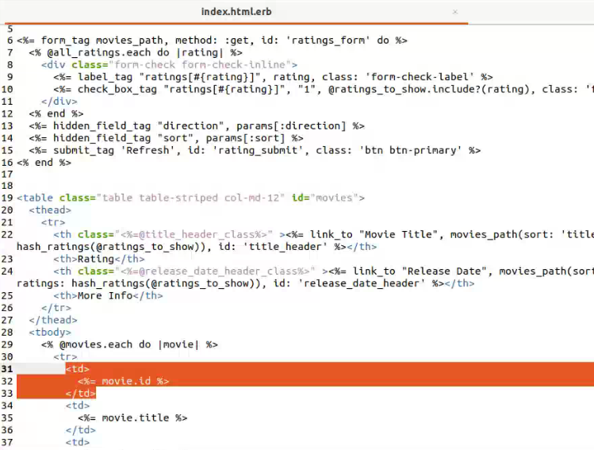
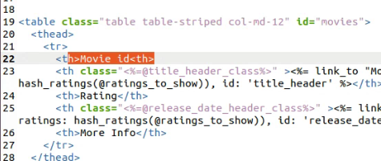
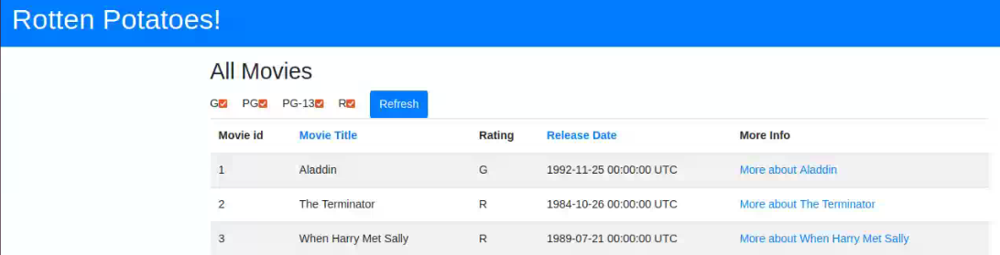

# Práctica Calificada 4 <!-- omit in toc -->

- [Pregunta 2](#pregunta-2)
  - [Apartado](#apartado)
- [Pregunta: introducción a Rails](#pregunta-introducción-a-rails)
  - [Apartado A: index](#apartado-a-index)
  - [Apartado B](#apartado-b)
  - [Apartado C](#apartado-c)
  - [Apartado D](#apartado-d)

## Pregunta 2

### Apartado

Diseñamos e implementamos [estas dos clases](/Semana8/Actividad/README.md#clases) en la actividad de introducción a JavaScript.

## Pregunta: introducción a Rails

Para responder esta pregunta utiliza el repositorio y las actividades que has desarrollado de Introducción a Rails.

### Apartado A: index

Modifica la vista Index para incluir el número de fila de cada fila en la tabla de películas.

### Apartado B

Modifica la vista Index para que cuando se sitúe el ratón sobre una fila de la tabla, dicha fila cambie temporalmente su color de fondo a amarillo u otro color.

### Apartado C

Modifica la acción Index del controlador para que devuelva las películas ordenadas alfabéticamente por título, en vez de por fecha de lanzamiento. No intentes ordenar el resultado de la llamada que hace el controlador a la base de datos. Los gestores de bases de datos ofrecen formas para especificar el orden en que se quiere una lista de resultados y, gracias al fuerte acoplamiento entre ActiveRecord y el sistema gestor de bases de datos (RDBMS) que hay debajo, los métodos find y all de la biblioteca de ActiveRecord en Rails ofrece una manera de pedirle al RDBMS que haga esto.

### Apartado D

Simula que no dispones de ese fuerte acoplamiento de ActiveRecord, y que no puedes asumir que el sistema de almacenamiento que hay por debajo pueda devolver la colección de ítems en un orden determinado. Modifique la acción Index del controlador para que devuelva las películas ordenadas alfabéticamente por título. Utiliza el método sort del módulo Enumerable de Ruby.

