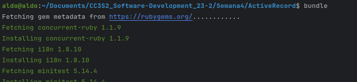

```bash
$ ruby --version
# ruby 2.7.0p0...
$ bundle
# Your Ruby version is 2.7.0, but your Gemfile specified 2.6.6
$ rvm install "ruby-2.6.6"
# Searching for binary rubies, this might take some time.
# ...
$ bundle
```



