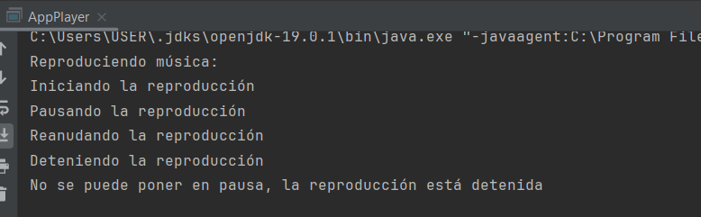
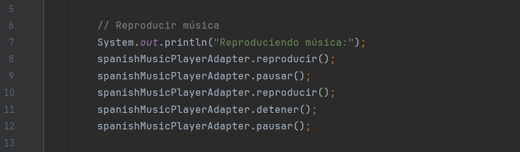
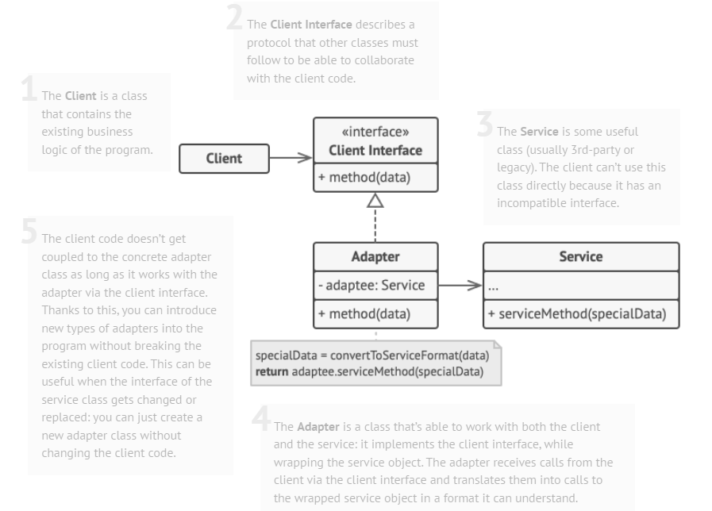
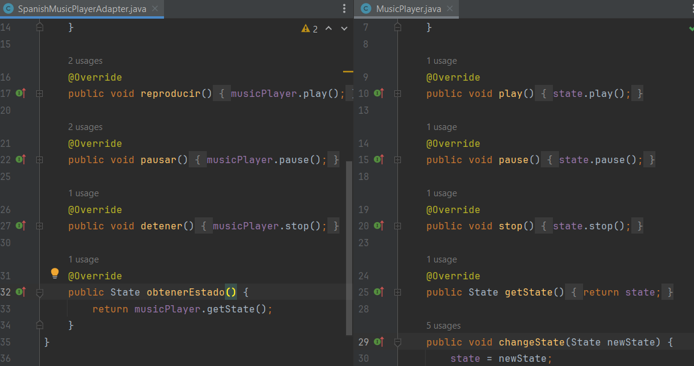
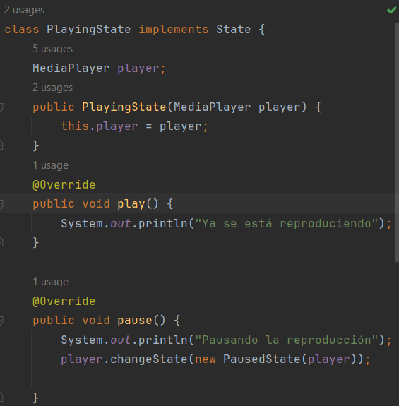
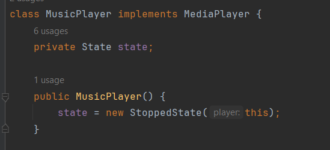
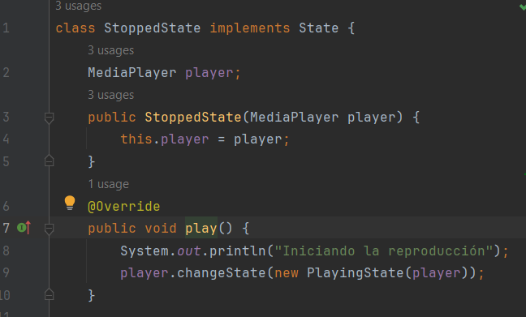
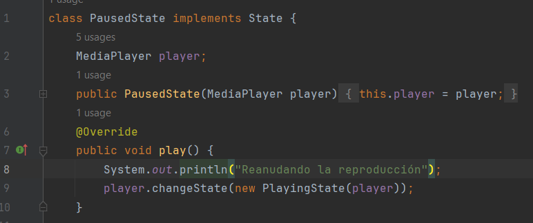

# Patrones de diseño

## Teoría

Implementaremos un sistema de reproducción de medios que utiliza los patrones de diseño Adapter, State y Abstract Factory.
El problema que hace posible la creación de este código es la necesidad de crear un sistema de reproducción de medios que sea flexible y extensible.

**State**

El patrón State se emplea para representar objetos que tienen la capacidad de modificar su comportamiento en respuesta a cambios en su estado interno, lo que posibilita que un objeto ajuste su forma de actuar cuando su estado cambia. Su uso consiste cuando tienes un objeto que puede tener diferentes estados y deseas que responda de manera diferente según su estado actual, lo que previene la necesidad de utilizar múltiples construcciones condicionales, como sentencias if o switch para manejar diferentes comportamientos según el estado.

**Adapter**

El patrón Adapter se utiliza cuando necesitas que dos interfaces incompatibles trabajen juntas. Actúa como un puente entre dos interfaces para que puedan colaborar sin problemas. Su uso consiste cuando deseas integrar una clase o componente existente en tu sistema que tiene una interfaz incompatible con la que necesitas en tu código. También se usa para reutilizar una clase existente que no se ajusta a la interfaz requerida. Por ejemplo, imaginemos que tenemos una clase A con una interfaz específica, pero necesitas utilizarla en un contexto donde solo se acepta una interfaz diferente, como B. En este caso, puedes crear un adaptador que implemente la interfaz B y que internamente utilice instancias de la clase A, adaptando sus métodos para que sean compatibles con la interfaz B.

**Abstract Factory**

El patrón Abstract Factory ofrece una interfaz para construir conjuntos de objetos relacionados sin la necesidad de definir explícitamente las clases específicas involucradas. Esto habilita al cliente para generar objetos sin requerir un conocimiento detallado sobre la implementación concreta de cada uno. Su uso consisye cuando necesitas crear objetos que pertenecen a una familia de productos relacionados y deseas que estos objetos sean coherentes entre sí. También se usa cuando quieres aislar el código cliente de las clases concretas, lo que facilita la sustitución de una familia de objetos por otra sin modificar el código del cliente. Por ejemplo, en nuestro codigo.

## Práctica

Para esta actividad solo hemos podido unificar dos patrones: State y Adapter. 

El patrón State se manifiesta en la salida de la consola:

¿Por qué? Después de «Reproduciendo música», se imprimen cinco líneas que corresponden con estas cinco llamadas (líneas 8-12):

Analicemos el método `reproducir()` llamado dos veces por `spanishMusicPlayerAdapter` en la línea 8 y 10, y arroja salidas distintas: «Iniciando la reproducción» y «Reanudando la reproducción». Esta diferencia se debe a que el estado interno de la clase cambió cuando se llamó el método `reproducir()` por segunda vez y permitió que su comportamiento se ajuste según este otro estado.

Pero la clase SpanishMusicPlayerAdapter no maneja estados: es solo un adaptador. Concretamente es un adaptador de tipo clase (Class Adapter) y no de tipo objeto (Object Adapter):

Siguiendo el esquema general de arriba para nuestro caso, la clase cliente sería AppPlayer, la interface ClientInterface sería SpanishMediaPlayer, el adaptador sería la clase SpanishMediaPlayerAdapter, y el servicio adaptado sería la clase MusicPlayer.

La idea quizás es un poco forzada y poco realista, pero se trata de que el cliente quiere que los métodos de la interfaz y los mensajes estén en español. Nuestro adaptador lo único que hace es envolver los métodos de MusicPlayer dentro de los métodos de SpanishSpanishMediaPlayer. Nos falta la parte de hacer alguna conversión de la información del mensaje, traduciéndolo quizás.

Como dijimos antes, la clase SpanishMusicPlayerAdapter no tiene estados internos. La clase que los tiene es MusicPlayer, gracias a su objeto state de tipo State. El estado es definido de forma abstracta en la interface State con los métodos play(), pause() y stop() que representan acciones para cambiar de estado. Estos métodos son implementados en las clases PlayingState, PauseState y StopedState. Si quisieramos agregar un estado más, solo tenemos que extender nuestra base de código creando una nueva clase (p. e. NewState), en vez de modificar una clase ya existente.

Para entender cómo implementamos los estados, podemos ver un fragmento de una de las clases de tipo State:

Tiene un objeto player de tipo MediaPlayer obtenido por inversión de dependencia a través del constructor. Este objeto player será la constante en todo el proceso. En el método pause() se ve cómo este objeto llama al método especial changeState(). Gracias al polimorfismo podemos pasarle a este método una instancia de cualquier clase que implemente la interfaz State. Para cambiar de estado creamos una instancia del estado al que queremos cambiar, y le pasamos como parámetro el mismo objeto player capaz de cambiar de estado, esto porque queremos que los métodos de esta nueva instancia de State puedan seguir llamando al método changeState() desde el mismo objeto player.

Pero debe haber un estado desde el cual partimos por defecto. Elegimos el estado representado por la clase StopedState y lo creamos en el constructor de MusicPlayer (clase que implementa a MediaPlayer):

Entonces, en la clase AppPlayer, la salidas de las líneas 8 y 10 que estabamos analizando eran distintas porque la llamada de 8 partía del estado StoppedState y terminaba usando este método play():

Mientras que la llamada de la línea 10 partía del estado PausedState y terminaba usando este otro método play():

Una pequeña tabla de estados nos puede ayudar a ver todos los resultados que abarcamos desde cada estado:

| Estados\Métodos | play() | pause() | stop() |
|:---:|:---:|:---:|:---:|
| StopedState | PlayingState ("Iniciando") | StopedState ("No se puede...") | StopedState |
| PlayingState | PlayingState ("Ya se está...") | PausedState ("Pausando...") | StopedState ("Deteniendo") |
| PausedState | PlayingState ("Reanudando") | PausedState ("Ya se encuentra...") | StopedState ("Deteniendo") |

Es evidente que solucionar esto con estructuras condicionales, switch-case y variables booleanas habría sido muy engorroso, no extensible y propenspo a error.