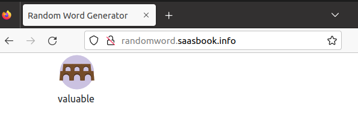
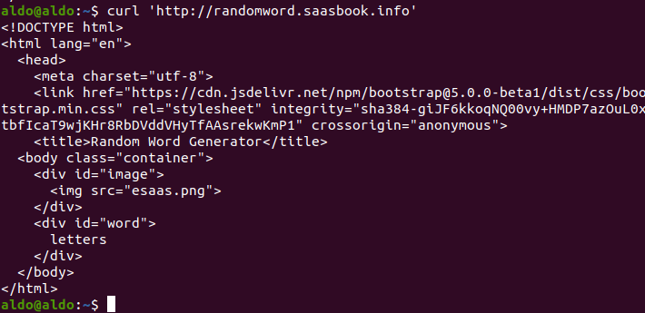
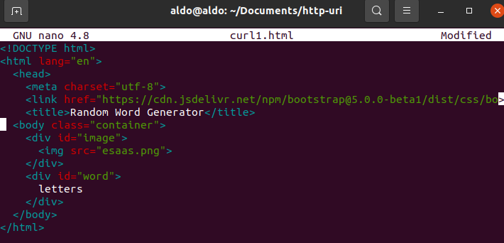
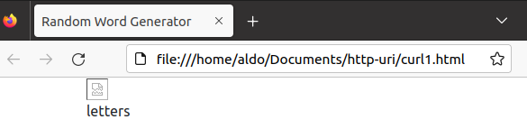
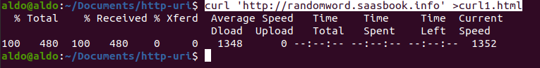
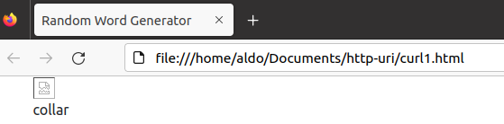
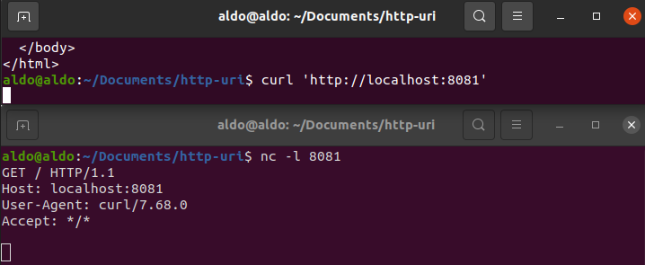
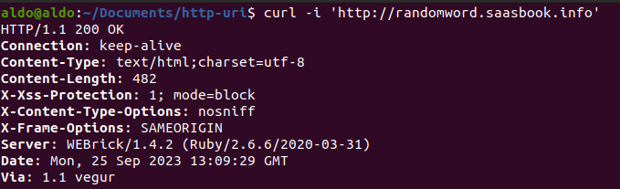
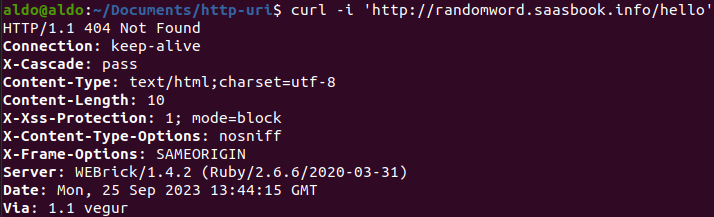

# Introducción a HTTP y URI <!-- omit in toc -->

## Comprendiendo Request y Response

Al visitar la página web http://randomword.saasbook.info, el resultado en el cuerpo de la página es solo una imagen y una palabra. Cuando recargamos la página, se muestra la misma imagen y otra palabra.

Ahora probamos el comando `curl 'http://randomword.saasbook.info'` en el terminal:

Comprobamos que este resultado se corresponde con el resultado al visitar la página a través del navegador. El elemento HTML `body` tiene dos contenedores `div`: uno es para la imagen y el otro para la palabra generada aletariamente (que en este caso es _letters_).

Guardamos el resultado en un archivo html:

Y abrimos el archivo en nuestro navegador:

Vemos que aparece la palabra generada y el título Random Word Generator, pero falta la imagen. Esto es porque en el archivo html la referencia a la imagen es local: es necesario tener la imagen en el mismo directorio que el archivo html para que esta se muestre.

Seguimos las sugerencias: agregar `>nombre_archivo` luego del comando curl para que la salida se almacene directamente en un archivo que denominamos con la extensión (.html).

Ahora solo ejecutamos el comando `curl 'http://randomword.saasbook.info' >curl1.html` para sobreescribir la nueva salida en el archivo _curl1.html_:

Y recargamos la pestaña del navegador en la que habíamos abierto el archivo para ver la nueva palabra generada:

**Pregunta:** ¿Cuáles son las dos diferencias principales entre lo que has visto anteriormente y lo que ves en un navegador web 'normal'? ¿Qué explica estas diferencias?

**Respuesta:** Las diferencia entre lo que visualizamos en el navegador cuando visitamos la página y lo que vemos cuando abrimos el archivo _curl1.html_ son dos: la url y la imagen. En el primer caso tenemos una url que sigue el protocolo HTTP y vemos la imagen, mientras que en el segundo caso la url es una ruta local hacia nuestro archivo y la imagen no se visualiza porque no disponemos de ella.

**Pregunta:** Suponiendo que estás ejecutando curl desde otro shell, ¿qué URL tendrás que pasarle a curl para intentar acceder a tu servidor falso y por qué? 

**Respuesta:**

El servidor falso que creamos es nuestro propio servidor local (localhost), y con netcat lo configuramos para escuchar por el puerto 8081. Por eso se accede a este servidor a través del protocolo http con la url http://localhost:8081.

**Pregunta:** La primera línea de la solicitud identifica qué URL desea recuperar el cliente. ¿Por qué no ves `http://localhost:8081` en ninguna parte de esa línea? 

**Respuesta:**

La primera línea omite la url porque estamos en un servidor local.

Ahora ejecutamos el comando `curl -i 'http://randomword.saasbook.info'` para ver el encabezado de la respuesta.

**Pregunta:** Según los encabezados del servidor, ¿cuál es el código de respuesta HTTP del servidor que indica el estado de la solicitud del cliente y qué versión del protocolo HTTP utilizó el servidor para responder al cliente? 

**Respuesta**

El código de respuesta HTTP es 200, lo cual indica que la solicitud ha tenido éxito. En nuestro caso, como hicimos una solicitud GET, el código 200 significa que la información ha sido recuperada exitosamente. Por otro lado, la versión del protocolo HTTP es 1.1.

**Pregunta:** Cualquier solicitud web determinada puede devolver una página HTML, una imagen u otros tipos de entidades. 
¿Hay algo en los encabezados que crea que le dice al cliente cómo interpretar el resultado?

Sí, el campo Content-Type o 'tipo de contenido'. En este caso, le dice al cliente que debe interpretar el resultado como un texto de código html.

## ¿Qué sucede cuando falla un HTTP request? 

**Pregunta:** ¿Cuál sería el código de respuesta del servidor si intentaras buscar una URL inexistente en el sitio generador de palabras aleatorias? Pruéba esto utilizando el procedimiento anterior. 

Añadimos una ruta a un recurso que no existe en el servidor al que estamos enviando la solicitud: _/hello_

El código que obtenemos en el encabezado es 404, que indica que la información que se quiere recuperar no fue encontrada.

**Pregunta**

Tanto el encabezado `4xx` como el `5xx` indican condiciones de error. ¿Cuál es la principal diferencia entre `4xx` y `5xx`?.

**Respuesta**

Ambas familias de errores indican que hay un problema que impide que el servidor envíe una respuesta exitosa. La diferencia es de qué lado viene el error. El código `4xx` indica que el problema está en la solicitud que hizo el cliente, mientras que el código `5xx` indica que el error se produjo en el servidor web al que enviamos la solicitud.

Pensando en la anterior pregunta, el código obtenido 404 es coherente con esto que acabamos de explicar, ya que el problema es que estamos solicitando un recurso inexistente, es decir, el problema viene del lado del cliente, de la solicitud que envía.

## ¿Qué es un cuerpo de Request?

## HTTP sin estados y cookies

