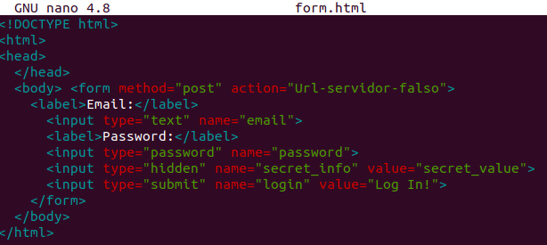

# Introducción a HTTP y URI <!-- omit in toc -->

- [Comprendiendo Request y Response](#comprendiendo-request-y-response)
- [¿Qué sucede cuando falla un HTTP request?](#qué-sucede-cuando-falla-un-http-request)
- [¿Qué es un cuerpo de Request?](#qué-es-un-cuerpo-de-request)
- [HTTP sin estados y cookies](#http-sin-estados-y-cookies)

## Comprendiendo Request y Response

Al visitar la página web http://randomword.saasbook.info, el resultado en el cuerpo de la página es solo una imagen y una palabra. Cuando recargamos la página, se muestra la misma imagen y otra palabra. Entonces, lo único que cambia es la palabra, que se genera aleatoriamente.

Ahora probamos el comando `curl 'http://randomword.saasbook.info'` en el terminal:

Comprobamos que este resultado se corresponde con el resultado al visitar la página a través del navegador. El elemento HTML `body` tiene dos contenedores `div`: uno es para la imagen y el otro para la palabra generada aletariamente (que en este caso es _letters_).

Guardamos el resultado en un archivo html:

Y abrimos el archivo en nuestro navegador:

Vemos que aparece la palabra generada y el título Random Word Generator, pero falta la imagen. Esto es porque en el archivo html la referencia a la imagen es local: es necesario tener la imagen en el mismo directorio que el archivo html para que esta se muestre.

Seguimos las sugerencias: agregar `>nombre_archivo` luego del comando curl para que la salida se almacene directamente en un archivo que denominamos con la extensión (.html).

Ahora solo ejecutamos el comando `curl 'http://randomword.saasbook.info' >curl1.html` para sobreescribir la nueva salida en el archivo _curl1.html_:

Y recargamos la pestaña del navegador en la que habíamos abierto el archivo para ver la nueva palabra generada:

**Pregunta:** ¿Cuáles son las dos diferencias principales entre lo que has visto anteriormente y lo que ves en un navegador web 'normal'? ¿Qué explica estas diferencias?

**Respuesta:** Las diferencia entre lo que visualizamos en el navegador cuando visitamos la página y lo que vemos cuando abrimos el archivo _curl1.html_ son dos: la url y la imagen. En el primer caso tenemos una url que sigue el protocolo HTTP y vemos la imagen, mientras que en el segundo caso la url es una ruta local hacia nuestro archivo y la imagen no se visualiza porque no disponemos de ella.

**Pregunta:** Suponiendo que estás ejecutando curl desde otro shell, ¿qué URL tendrás que pasarle a curl para intentar acceder a tu servidor falso y por qué?

**Respuesta:**

El servidor falso que creamos es nuestro propio servidor local (localhost), y con netcat lo configuramos para escuchar por el puerto 8081. Por eso se accede a este servidor a través del protocolo http con la url http://localhost:8081.

**Pregunta:** La primera línea de la solicitud identifica qué URL desea recuperar el cliente. ¿Por qué no ves `http://localhost:8081` en ninguna parte de esa línea?

**Respuesta:**

La primera línea omite la url porque estamos en un servidor local.

La primera línea de la solicitud no contiene porque el cliente est{a especificando la ruta relativa "/" en lugar de la url completa

Ahora ejecutamos el comando `curl -i 'http://randomword.saasbook.info'` para ver el encabezado de la respuesta.

**Pregunta:** Según los encabezados del servidor, ¿cuál es el código de respuesta HTTP del servidor que indica el estado de la solicitud del cliente y qué versión del protocolo HTTP utilizó el servidor para responder al cliente?

**Respuesta**

El código de respuesta HTTP es 200, lo cual indica que la solicitud ha tenido éxito. En nuestro caso, como hicimos una solicitud GET, el código 200 significa que la información ha sido recuperada exitosamente. Por otro lado, la versión del protocolo HTTP es 1.1.

**Pregunta:** Cualquier solicitud web determinada puede devolver una página HTML, una imagen u otros tipos de entidades.
¿Hay algo en los encabezados que crea que le dice al cliente cómo interpretar el resultado?

Sí, el campo Content-Type o 'tipo de contenido'. En este caso, le dice al cliente que debe interpretar el resultado como un texto de código html.

## ¿Qué sucede cuando falla un HTTP request?

**Pregunta:** ¿Cuál sería el código de respuesta del servidor si intentaras buscar una URL inexistente en el sitio generador de palabras aleatorias? Pruéba esto utilizando el procedimiento anterior.

Añadimos una ruta a un recurso que no existe en el servidor al que estamos enviando la solicitud: _/hello_

El código que obtenemos en el encabezado es 404, que indica que la información que se quiere recuperar no fue encontrada.

**Pregunta**

Tanto el encabezado `4xx` como el `5xx` indican condiciones de error. ¿Cuál es la principal diferencia entre `4xx` y `5xx`?.

**Respuesta**

Ambas familias de errores indican que hay un problema que impide que el servidor envíe una respuesta exitosa. La diferencia es de qué lado viene el error. El código `4xx` indica que el problema está en la solicitud que hizo el cliente, mientras que el código `5xx` indica que el error se produjo en el servidor web al que enviamos la solicitud.

Pensando en la anterior pregunta, el código obtenido 404 es coherente con esto que acabamos de explicar, ya que el problema es que estamos solicitando un recurso inexistente, es decir, el problema viene del lado del cliente, de la solicitud que envía.

## ¿Qué es un cuerpo de Request?

Guardamos el formulario como _form.html_:

Abrimos y visualizamos el formulario en el navegador:

**Pregunta:** Cuando se envía un formulario HTML, se genera una solicitud HTTP `POST` desde el navegador. Para llegar a tu servidor falso, ¿con qué URL deberías reemplazar `Url-servidor-falso` en el archivo anterior? Modifica el archivo, ábrelo en el navegador web de tu computadora, completa algunos valores en el formulario y envíalo. Ahora ve a tu terminal y mira la ventana donde `nc` está escuchando. 

**Respuesta**

En la etiqueta form, cambiamos el atributo `action` con la url http://localhost:8081:

Abrimos nuevamente el archivo _form.html_ que fue modificado, ingresamos los datos hacemos clic en login. Esto desencadena la acción de enviar los datos al servidor falso, el cual está escuchando a través del puerto 8081 gracias al comando nc. Podemos ver que en el terminal en donde estamos conectados al servidor falso hemos obtenido los datos ingresados mediante una operación POST:

La operación POST fue definida en el atributo method de la etiqueta form. Esto se puede ver en la imagen anterior a esta.

**Pregunta:**¿Cómo se presenta al servidor la información que ingresó en el formulario? ¿Qué tareas necesitaría realizar un framework SaaS como Sinatra o Rails para presentar esta información en un formato conveniente a una aplicación SaaS escrita, por ejemplo, en Ruby?

**Respuesta**

La información se presenta al servidor así:

email=alunab%40uni.pe&password=123&secret_info=secret_value&login=Log+In%21

Donde %40 representa @

**Preguntas**

- **¿Cuál es el efecto de agregar parámetros `URI` adicionales como parte de la ruta `POST`?**

- No tiene ningún efecto. Solo agregamos un parámetro a la url del atributo action. Ahora será http://localhost:8081?some_parameter=x. La solicitud POST que recibe el servidor sigue siendo la misma, es decir esta: email=alunab%40uni.pe&password=123&secret_info=secret_value&login=Log+In%21
  
  

- **¿Cuál es el efecto de cambiar las propiedades de nombre de los campos del formulario?**

- Cambiar el valor del atributo nombre en los campos de entrada del formulario solo hace que el servidor obtenga una solicitud POST con con los mismos datos de entrada, pero asociados a otros nombre de atributo.
  
  

  En este caso, la solicitud ahora se ve así:

  

- **¿Puedes tener más de un botón `Submit`? Si es así, ¿cómo sabe el servidor en cuál se hizo clic? (Sugerencia: experimenta con los atributos de la etiqueta `<submit>`).**

- Si podemos tener más de una botón de tipo submit.
  
  

  

  Si le damos clic al segundo botón submit llamado _Log In! (2)_, la solicitud ahora incluye al final que viene de este botón:

  

  Sin embargo, si hubieramos dado a este segundo botón el mismo nombre y el mismo valor, no hubiera funcionado. En estas circunstancias solo funciona el primero.

  

- **¿Se puede enviar el formulario mediante `GET` en lugar de `POST`? En caso afirmativo, ¿cuál es la diferencia en cómo el servidor ve esas solicitudes?**

- Cambiamos el método a GET:
  

  La solicitud GET muestra en la primera línea los datos ingresados al formulario como parámetros de una url para recuperar una información.

  

  Seguramente sea una mala práctica hacer esto, pero los datos del formulario se han transmitido al servidor, así que sí se puede enviar el formulario mediante el método GET.

- **¿Qué otros verbos `HTTP` son posibles en la ruta de envío del formulario? ¿Puedes hacer que el navegador web genere una ruta que utilice `PUT`, `PATCH` o `DELETE`?**

- Respuesta
  - GET: Para obtener información del servidor.
  - POST: Para enviar información al servidor.
  - PUT: Para actualizar una entidad en el servidor.
  - PATCH: Para modificar parcialmente una entidad en el servidor.
  - DELETE: Para elminiar una entidad en el servidor.

## HTTP sin estados y cookies

Usaremos la aplicación que se encuentra en http://esaas-cookie-demo.herokuapp.com

**Pregunta:** Prueba las dos primeras operaciones `GET` anteriores ("GET /" y "GET /login"). El cuerpo de la respuesta para la primera debe ser `"Logged in: false"` y para la segunda `"Login cookie set"`.
¿Cuáles son las diferencias en los encabezados de respuesta que indican que la segunda operación está configurando una cookie? (Sugerencia: usa `curl -v`, que mostrará tanto los encabezados de solicitud como los encabezados y el cuerpo de la respuesta, junto con otra información de depuración. `curl --help` imprimirá una ayuda voluminosa para usar `cURL` y `man curl` mostrará la página del manual de Unix  para cURL en la mayoría de los sistemas.)

Las cookies pueden configurarse como seguras, lo que significa que solo se transmiten a través de

Como se nos pide, probamos las dos operaciones y logramos obtener el cuerpo de respuesta esperado en ambas, resaltado a continuación:

La diferencia en los encabezados está en la línea de la operación GET. En el primero es _GET / HTTP/1.1_ (manda a la raíz) y en el segundo es _GET /login HTTP/1.1_

Este comportamiento se puede analizar desde el código de la propia aplicación:

**Pregunta:** Prueba las dos primeras operaciones `GET` anteriores. El cuerpo de la respuesta para la primera debe ser `"Logged in: false"` y para la segunda `"Login cookie set"`. 
¿Cuáles son las diferencias en los encabezados de respuesta que indican que la segunda operación está configurando una cookie? (Sugerencia: usa `curl -v`, que mostrará tanto los encabezados de solicitud como los encabezados y el cuerpo de la respuesta, junto con otra información de depuración. `curl --help` imprimirá una ayuda voluminosa para usar `cURL` y `man curl` mostrará la página del manual de Unix  para cURL en la mayoría de los sistemas.) 

**Pregunta:** Bien, ahora supuestamente `"logged in"` porque el servidor configuró una cookie que indica esto. Sin embargo, si intentaa `GET /` nuevamente, seguirá diciendo `"Logged: false"`. 
¿Qué está sucediendo? (Sugerencia: `usa curl -v` y observa los encabezados de solicitud del cliente). 

