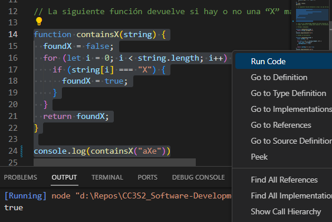

# Actividad de introducción a JavaScript

## Arrays

```javascript
[1, 2, 3] + [4, 5, 6]
!![]
[] == true
[10, 1, 3].sort()
[] == 0​
```

Resultados:

```
1,2,34,5,6
true
false
[ 1, 10, 3 ]
true
```

Explicación:

1. En Javascript el operador `+` se usa para la sumade números o para la concatenación de cadenas. Como lo que tenemos no son números ni cadenas, sino arrays, estos son convertidos en las cadenas "1,2,3" y "4,5,6", que concatenadas dan el resultado "1,2,34,5,6".
   
2. En Javascript el arreglo vacío `[]` es un objeto cuyo valor en contexto booleano es `true`. El operador lógico de doble negación `!!` proporciona ese contexto booleano a la vez que deja el mismo valor donde se aplica.

3. Según lo que dijimos, lo esperable sería que el resultado de la comparación `==` sea `true`. No es el caso debido a la coerción de tipos de datos. Esta coerción se maneja según una serie de reglas definidas en [estas especificaciones de ECMAScript](https://262.ecma-international.org/10.0/#sec-abstract-equality-comparison). También se explica de forma resumida en [este foro](https://stackoverflow.com/questions/58255112/why-do-both-true-and-true-evaluate-to-false#:~:text=For%20%5B%5D%20%3D%3D%20true%20%2C%20rule,false%20%3D%3D%20true%20returns%20false%20.). Básicamente, el arreglo vacío `[]` se convierte en `0`, y `0` no es igual a `true`, así que la comparación de igualdad no estricta da como resultado `false`.

4. En Javascript, el método `sort()` a secas ordena los elementos de una arreglo como cadenas de texto, mediante una comparación lexicográfica. Si queremos ordenarlos según sus valores numéricos, debemos pasarle a `sort()` una función de comparación como parámetro:
    ```javascript
    [1, 10, 3].sort(function(a, b) {
      return a - b;
    })
    ```

5. Debido a la coerción de tipo de datos de Javascript, el arreglo vacío `[]` se convierte automáticamente en un `0` en esta comparación de igualdad no estricta.

## Clausuras

**Pregunta**

Determina la salida del siguiente código.

```javascript
function f1(x) {
  var baz = 3;
  return function (y) {
    console.log(x + y + (baz++));
    }
}
var bar = f1(5);
bar(11);
```

**Respuesta**

El resultado es 19. Veamos lo que sucede paso a paso:

1. f1(5) se llama, por lo que x toma el valor de 5 y baz se inicializa en 3.
   
2. La función anidada se devuelve, y ahora bar es igual a esta función anidada, la cual trae consigo todo el contexto de la función que la contiene (los valores de x y de baz).
   
3. bar(11) se llama, y dentro de la función anidada, se imprime la suma de x (que es 5), y (que es 11), y el resultado de (baz++).
   
4. La expresión (baz++) primero usa el valor actual de baz (que es 3) en la suma y luego incrementa baz en 1.

La suma al final 5 + 11 + 3 = 19.

## Algoritmos

### Método `greatestNumber()`

La siguiente función encuentra el mayor número dentro de un array, pero tiene una eficiencia de $O(n^2)$ debido a que compara a cada elemento con todos.

```javascript
function greatestNumber(array) {
  for (let i of array) {
    let isIValTheGreatest = true;
    for (let j of array) {
      if (j > i) {
        isIValTheGreatest = false;
      }
    }
    if (isIValTheGreatest) {
      return i;
    }
  }
}
```

**Pregunta**

Reescribe la función para que se convierta en una $O(n)$ más rápida.

**Respuesta**

```javascript
function greatestNumber(array) {
  let currentGreatest = array[0]
  for (let element of array) {
    if (currentGreatest < element) {
      currentGreatest = element
    }
  }
  return currentGreatest
}
```

Mientras el anterior método ser podía hacer 

### Método `containsX()`

La siguiente función devuelve true o false si hay o no una "X" mayúscula dentro de una cadena.

```js
function containsX(string) {
  foundX = false;
  for (let i = 0; i < string.length; i++) {
    if (string[i] === "X") {
      foundX = true;
    }
  }
  return foundX;
}
```

Para correr solo el segmento seleccionado usamos la extensión Code Runner (clic drecho y clic en la opción _run code_). El resultado en la salida es true porque se le pasó a la función la cadena "aXe", la cual contiene la letra que esta función detecta.



**Pregunta**

¿Cuál es la complejidad temporal de esta función en términos de notación O grande? Luego, modifica el código para mejorar la eficiencia del algoritmo en los escenarios mejores y promedios.

**Respuesta**

La complejidad temporal de la anterior función es $O(n)$ porque conteine un bucle itera linealmente por cada caracter de la cadena hasta encontrar la "X" o llegar al final. Lamentablemente, la complejidad temporal para lograr el objetivo de esta función no se puede reducir en Javascript. Si hubiera una manera, con toda seguridad sería un método integrado. 

Tenemos dos métodos que pueden decirnos si una subcadena está incluida en una cadena: `includes()` e `indexOf()`. El primero básicamente usa por dentro al segundo, y el segundo usa un bucle muy parecido al de la anterior función. Esto se puede ver en el pseudocódigo proporcionado en la página oficial del estándar ECMAScript:


Por lo tanto, los siguientes códigos, si bien puede que sean igual o más eficientes que la anterior función, siguen siendo de complejidad O(n):

```javascript
// Con includes()
function containsX(string) {
  return string.includes("X")
}

// Con indexOf()
function containsX(string) {
  return string.indexOf("X") !== -1
}
```

La única manera de superar a $O(n)$ sería usando tablas hash, un diccionario. Sin embargo, el lenguaje no crea las cadenas con una representación interna de datos en forma de diccionario. La creación del diccionario sería igual de costosa en complejidad temporal:

```javascript
function containsX(string) {
  const charMap = {};

  for (let i = 0; i < string.length; i++) {
    const char = string[i];
    charMap[char] = true;
  }

  return charMap['X'] === true;
}
```

De hecho, parece que es la opción menos eficiente. En cada iteración hay dos instrucciones elementales que hacer, mientras que en las anteriores opciones solo era una operación elemental.

