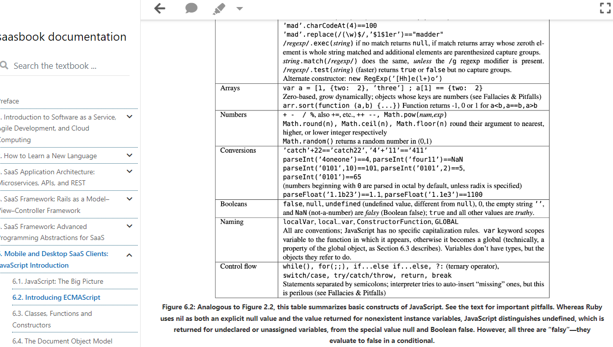

# Javascript

## Material de consulta

Para empezar con Javascript: [una serie de tutoriales de Digital Ocean](https://www.digitalocean.com/community/tutorial-series/how-to-code-in-javascript)

El mejor libro para estudiar Javascript: [Elocuent Javascript](https://eloquentjavascript.net/)

## Introducción

AL igual que Ruby, JS se interpreta dinámicamente
El tipo fundamental de JS es object: una colección desordenada de nombres basado en JSON.

La palabra class no introduce ningún mecanismo nuevo, solo es azúcar sintáctica.

Memoriza esto:

Como JS carece de clases sino funciones, la forma de administrar y ordenar las funciones es almacenarlas como colecciones de prototipos.

Cara objeto de JS hereda exactamente de un objeto de prototipo.

> El mercado peruano funciona por contactos, no por plataformas como upwork, toptal... 

javascript the good parts