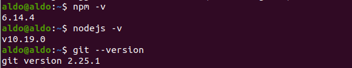
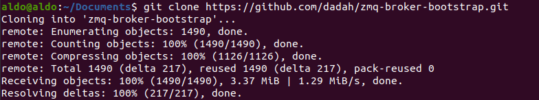
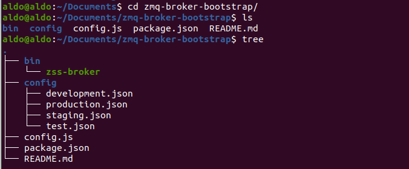
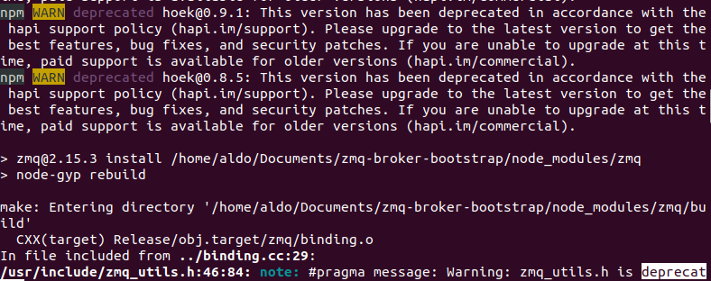
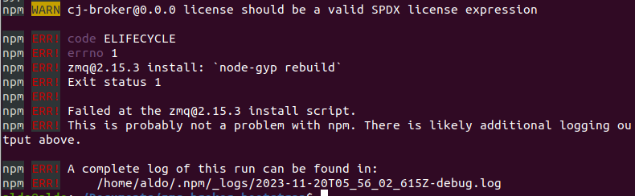
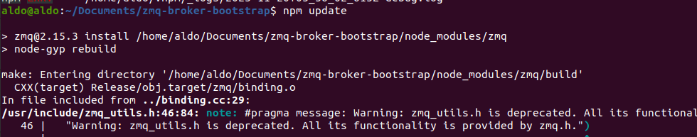

# Actividad: código limpio, manejo de excepciones, depuración

# Parte 2

Instalamos las dependencias:



Clonamos el repositorio:





El paso siguiente es correr el comando `npm install`. Por defecto, estecomando instalará todos los módulos listados como dependencias en package.json. Pero falla porque hay paquetes obsoletos que deben actualizarse a nuevas versiones:





Por eso antes ejecutamos este comando:

```bash
npm update
```

