# Rails avanzado

Siguiendo [la actividad](https://github.com/kapumota/Desarrollo-software-2023/blob/main/Semana7/Actividad1.md), copiamos la base de código del proyecto myrottenpotatoes y lo abrimos en RubyMine. Aquí el programa nos pide configurar e instalar drivers para conectarnos a la base de datos (SQLite).

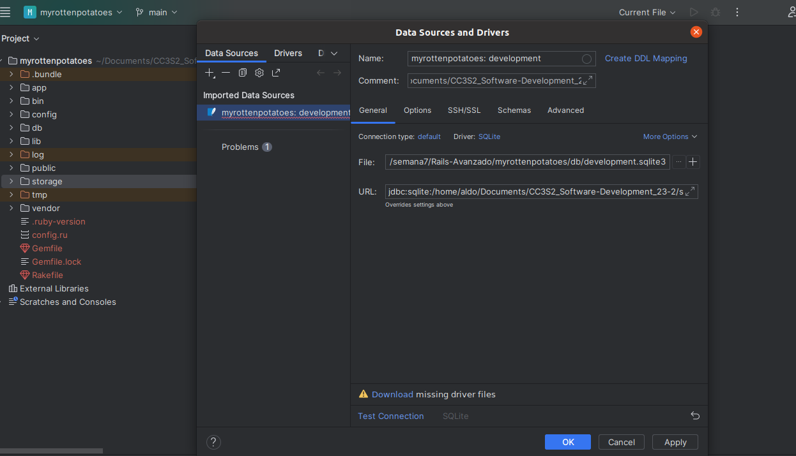

Una vez establecido este driver y la versión de Ruby a utilizar (3.0.2), procedemos a correr el programa y así saber en qué punto estamos. Como toda aplicación Rails, se corre en un servidor web que iniciamos mediante este comando:

```bash
bin/rails server
```

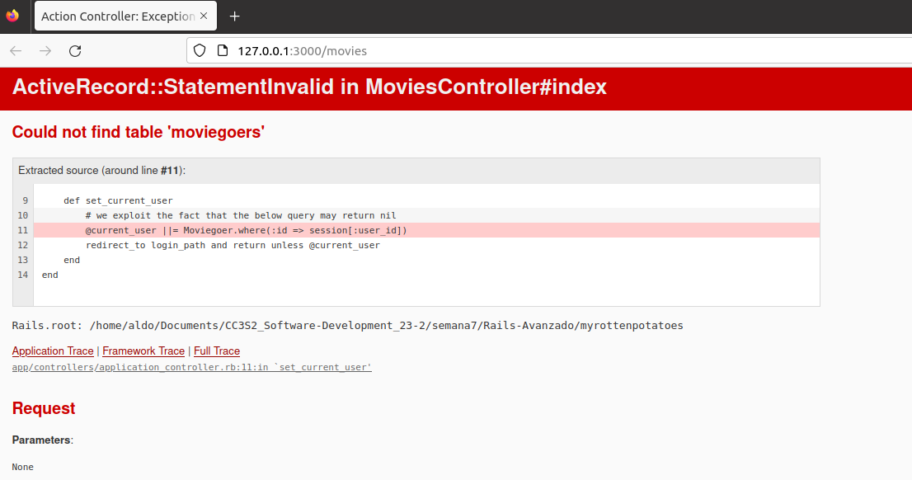

La página que se abre en el navegador en http://localhost:3000/movie nos muestra un error: ActiveRecord::StatementInvalid. Esto nos indica que hay un problema con una consulta SQL en nuestra aplicación Rails.

Si vemos qué pasó en el terminal, obtuvimos el código de error 500 Internal Server Error. Esto comprueba que fue un error del lado del servidor y no del cliente.

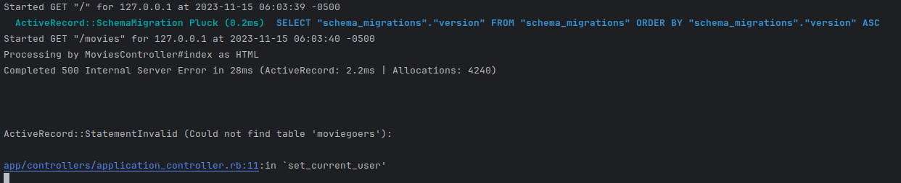

En la  terminal el error es claro: Rails no encuentra la tabla moviegoers. Además, nos dice que el error surgió en la línea 11 del script app/controllers/application_controller.rb, dentro del método set_current_user.

Para que esta tabla sea creada, necesitamos generar su migración correspondiente:

```bash
rails generate migration CreateMoviegoers 
```

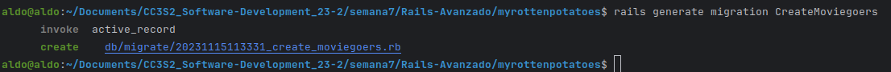

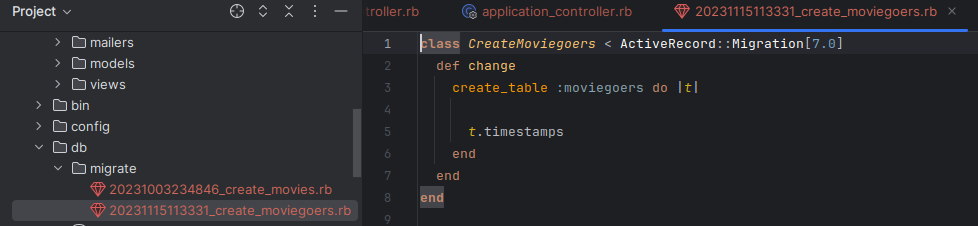

Como vemos en el nuevo archivo de migración, la clase CreateMoviegoers establece la creación de la tabla que necesitamos para resolver el error: moviegoers.

Ahora ejecutamos la migración para aplicar los cambios a la base de datos mediante este comando:

```bash
rails db:migrate
```

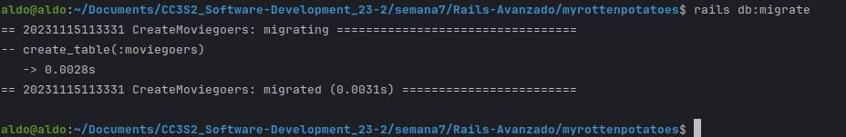

Observamos que los cambios efectuados por la nueva migración se reflejan en el archivo schema.rb

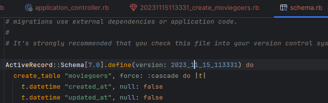

Volvemos a ejecutar el servidor con el comando `bin/rails server` y obtenemos el siguiente error de sintaxis:

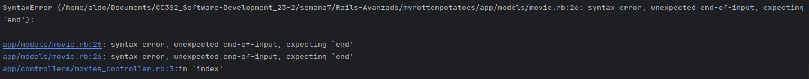

Afortunadamente, es muy sencillo de resolver y ya podemos disfrutar del programa corriendo sin ningún error:

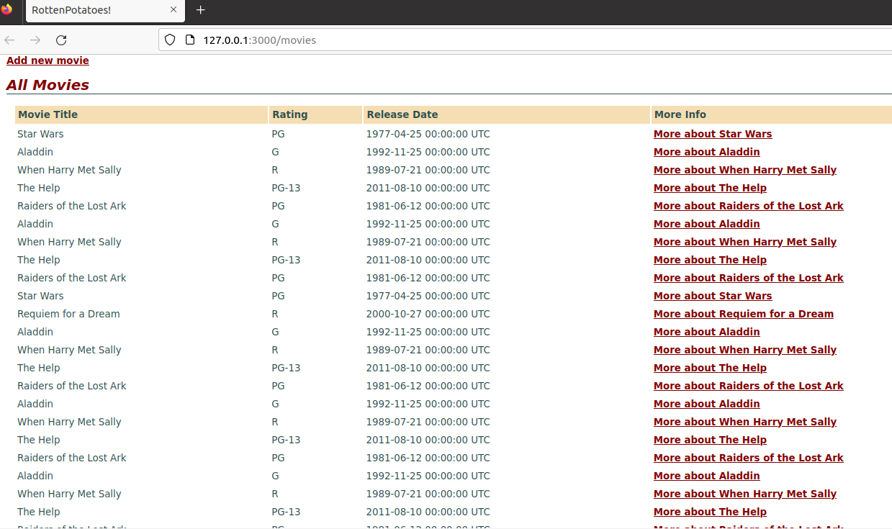

Ahora vamos a añadir un mecanismo de validación a la clase Movie en app/models/movie.rb cambiando este código:


```ruby
class Movie < ActiveRecord::Base
    before_save :capitalize_title
    def capitalize_title
        self.title = self.title.split(/\s+/).map(&:downcase).
          map(&:capitalize).join(' ')
    end
end
```

por el siguiente código:

```ruby
class Movie < ActiveRecord::Base
    def self.all_ratings ; %w[G PG PG-13 R NC-17] ; end #  shortcut: array of strings
    validates :title, :presence => true
    validates :release_date, :presence => true
    validate :released_1930_or_later # uses custom validator below
    validates :rating, :inclusion => {:in => Movie.all_ratings},
        :unless => :grandfathered?
    def released_1930_or_later
        errors.add(:release_date, 'must be 1930 or later') if
        release_date && release_date < Date.parse('1 Jan 1930')
    end
    @@grandfathered_date = Date.parse('1 Nov 1968')
    def grandfathered?
        release_date && release_date < @@grandfathered_date
    end
end
```

Para comprobar que las validaciones funcionan no necesitamos ejecutar el servidor web: basta con ejecutar la consola de Rails con el siguiente comando:

```bash
rails console
```

Y dentro de consola verificamos las validaciones al crear una nueva instancia de la clase Movie que declaramos con la variable _m_:

```ruby
m = Movie.new(:title => '', :rating => 'RG', :release_date => '1929-01-01')
m.valid?
m.errors[:title]
m.errors[:rating]
m.errors[:release_date]
m.errors.full_messages
```

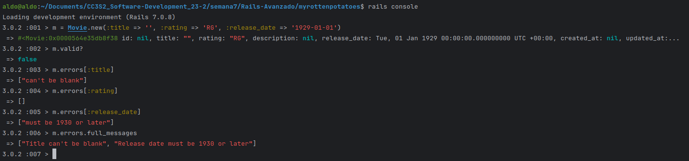

Ahora analizaremos el código del controlador de las peliculas:

```ruby
class MoviesController < ApplicationController
  def new
    @movie = Movie.new
  end 
  def create
    if (@movie = Movie.create(movie_params))
      redirect_to movies_path, :notice => "#{@movie.title} created."
    else
      flash[:alert] = "Movie #{@movie.title} could not be created: " +
        @movie.errors.full_messages.join(",")
      render 'new'
    end
  end
  def edit
    @movie = Movie.find params[:id]
  end
  def update
    @movie = Movie.find params[:id]
    if (@movie.update_attributes(movie_params))
      redirect_to movie_path(@movie), :notice => "#{@movie.title} updated."
    else
      flash[:alert] = "#{@movie.title} could not be updated: " +
        @movie.errors.full_messages.join(",")
      render 'edit'
    end
  end
  def destroy
    @movie = Movie.find(params[:id])
    @movie.destroy
    redirect_to movies_path, :notice => "#{@movie.title} deleted."
  end
  private
  def movie_params
    params.require(:movie)
    params[:movie].permit(:title,:rating,:release_date)
  end
end
```

Este código sigue las convenciones estándar de Rails para el manejo de operaciones CRUD y forma parte de la arquitectura Modelo-Vista-Controlador (MVC) en la que el controlador interactúa con el modelo para realizar operaciones con la base de datos y pasa los datos a las vistas para su renderizado.

Editamos el archivo movie.rb y comprobamos que el siguiente codigo ilustra cómo utilizar este mecanismo para “canonicalizar” (estandarizar el formato de) ciertos campos del modelo antes de guardar el modelo.

```ruby
class Movie < ActiveRecord::Base
    before_save :capitalize_title
    def capitalize_title
        self.title = self.title.split(/\s+/).map(&:downcase).
        map(&:capitalize).join(' ')
    end
end
```


Tiramos las siguientes instrucciones en la consola de Rails para comprobar que el dato del título se ha normalizado:

```ruby
m = Movie.create!(:title => 'STAR  wars', :release_date => '27-5-1977', :rating => 'PG')

m.title
```

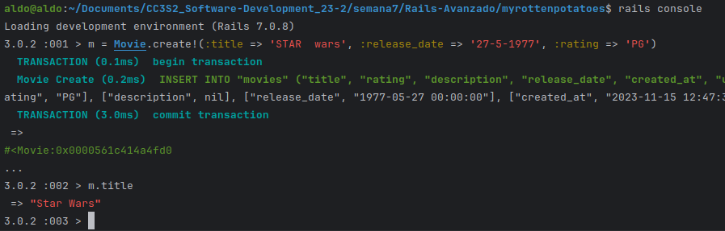

Como vemos, el título que introducimos con la primera palabra toda en mayúsculas no es el mismo que el que se guardó: solo las primeras letras de cada palabra están en mayúscula.