# Rails avanzado <!-- omit in toc -->

- [Vistas parciales, validaciones y filtros](#vistas-parciales-validaciones-y-filtros)
- [SSO y autenticación a través de terceros](#sso-y-autenticación-a-través-de-terceros)
  - [Modelo y migración para representar usuarios](#modelo-y-migración-para-representar-usuarios)
  - [Creación de una cuenta de desarrollador de Twitter](#creación-de-una-cuenta-de-desarrollador-de-twitter)

## Vistas parciales, validaciones y filtros

Siguiendo [la actividad](https://github.com/kapumota/Desarrollo-software-2023/blob/main/Semana7/Actividad1.md), copiamos la base de código del proyecto myrottenpotatoes y lo abrimos en RubyMine. Aquí el programa nos pide configurar e instalar drivers para conectarnos a la base de datos (SQLite).


Una vez establecido este driver y la versión de Ruby a utilizar (3.0.2), procedemos a correr el programa y así saber en qué punto estamos. Como toda aplicación Rails, se corre en un servidor web que iniciamos mediante este comando:

```bash
bin/rails server
```


La página que se abre en el navegador en http://localhost:3000/movie nos muestra un error: ActiveRecord::StatementInvalid. Esto nos indica que hay un problema con una consulta SQL en nuestra aplicación Rails.

Si vemos qué pasó en el terminal, obtuvimos el código de error 500 Internal Server Error. Esto comprueba que fue un error del lado del servidor y no del cliente.


En la  terminal el error es claro: Rails no encuentra la tabla moviegoers. Además, nos dice que el error surgió en la línea 11 del script app/controllers/application_controller.rb, dentro del método set_current_user.

Para que esta tabla sea creada, necesitamos generar su migración correspondiente:

```bash
rails generate migration CreateMoviegoers 
```


Como vemos en el nuevo archivo de migración, la clase CreateMoviegoers establece la creación de la tabla que necesitamos para resolver el error: moviegoers.

Ahora ejecutamos la migración para aplicar los cambios a la base de datos mediante este comando:

```bash
rails db:migrate
```


Observamos que los cambios efectuados por la nueva migración se reflejan en el archivo schema.rb


Volvemos a ejecutar el servidor con el comando `bin/rails server` y obtenemos el siguiente error de sintaxis:


Afortunadamente, es muy sencillo de resolver y ya podemos disfrutar del programa corriendo sin ningún error:


Ahora vamos a añadir un mecanismo de validación a la clase Movie en app/models/movie.rb cambiando este código:


```ruby
class Movie < ActiveRecord::Base
    before_save :capitalize_title
    def capitalize_title
        self.title = self.title.split(/\s+/).map(&:downcase).
          map(&:capitalize).join(' ')
    end
end
```

por el siguiente código:

```ruby
class Movie < ActiveRecord::Base
    def self.all_ratings ; %w[G PG PG-13 R NC-17] ; end #  shortcut: array of strings
    validates :title, :presence => true
    validates :release_date, :presence => true
    validate :released_1930_or_later # uses custom validator below
    validates :rating, :inclusion => {:in => Movie.all_ratings},
        :unless => :grandfathered?
    def released_1930_or_later
        errors.add(:release_date, 'must be 1930 or later') if
        release_date && release_date < Date.parse('1 Jan 1930')
    end
    @@grandfathered_date = Date.parse('1 Nov 1968')
    def grandfathered?
        release_date && release_date < @@grandfathered_date
    end
end
```

Para comprobar que las validaciones funcionan no necesitamos ejecutar el servidor web: basta con ejecutar la consola de Rails con el siguiente comando:

```bash
rails console
```

Y dentro de consola verificamos las validaciones al crear una nueva instancia de la clase Movie que declaramos con la variable _m_:

```ruby
m = Movie.new(:title => '', :rating => 'RG', :release_date => '1929-01-01')
m.valid?
m.errors[:title]
m.errors[:rating]
m.errors[:release_date]
m.errors.full_messages
```


Ahora analizaremos el código del controlador de las peliculas:

```ruby
class MoviesController < ApplicationController
  def new
    @movie = Movie.new
  end 
  def create
    if (@movie = Movie.create(movie_params))
      redirect_to movies_path, :notice => "#{@movie.title} created."
    else
      flash[:alert] = "Movie #{@movie.title} could not be created: " +
        @movie.errors.full_messages.join(",")
      render 'new'
    end
  end
  def edit
    @movie = Movie.find params[:id]
  end
  def update
    @movie = Movie.find params[:id]
    if (@movie.update_attributes(movie_params))
      redirect_to movie_path(@movie), :notice => "#{@movie.title} updated."
    else
      flash[:alert] = "#{@movie.title} could not be updated: " +
        @movie.errors.full_messages.join(",")
      render 'edit'
    end
  end
  def destroy
    @movie = Movie.find(params[:id])
    @movie.destroy
    redirect_to movies_path, :notice => "#{@movie.title} deleted."
  end
  private
  def movie_params
    params.require(:movie)
    params[:movie].permit(:title,:rating,:release_date)
  end
end
```

Este código sigue las convenciones estándar de Rails para el manejo de operaciones CRUD y forma parte de la arquitectura Modelo-Vista-Controlador (MVC) en la que el controlador interactúa con el modelo para realizar operaciones con la base de datos y pasa los datos a las vistas para su renderizado.

Editamos el archivo movie.rb y comprobamos que el siguiente codigo ilustra cómo utilizar este mecanismo para “canonicalizar” (estandarizar el formato de) ciertos campos del modelo antes de guardar el modelo.

```ruby
class Movie < ActiveRecord::Base
    before_save :capitalize_title
    def capitalize_title
        self.title = self.title.split(/\s+/).map(&:downcase).
        map(&:capitalize).join(' ')
    end
end
```


Ejecutamos los siguientes comandos en la consola de Rails para comprobar que el dato del título se ha normalizado:

```ruby
m = Movie.create!(:title => 'STAR  wars', :release_date => '27-5-1977', :rating => 'PG')

m.title
```


Como vemos, el título que introducimos con la primera palabra toda en mayúsculas no es el mismo que el que se guardó: solo las primeras letras de cada palabra están en mayúscula.

## SSO y autenticación a través de terceros

### Modelo y migración para representar usuarios

Aquí la actividad nos pide ejecutar el siguiente comando:

```bash
rails generate model Moviegoer name:string provider:string uid:string
```

Sin embargo, este comando usa el nombre _Moviegoer_, el cual ya usamos en la aplicación. Pero Rails nos ofrece la opción de saltarnos la colisión y forzar la generación del modelo y la migración que queremos. Solo tenemos que agregar lo siguiente:

```bash
rails generate model Moviegoer name:string provider:string uid:string --skip-collision-check --force
```

Este comando elimina el archivo de migración anterior, es decir _20231115113331_create_moviegoers.rb_, crea un nuevo archivo de migración _20231116125226_create_moviegoers.rb_ y sobrescribe el archivo _moviegoer.rb_
 del modelo Moviegoer. Procedí así:

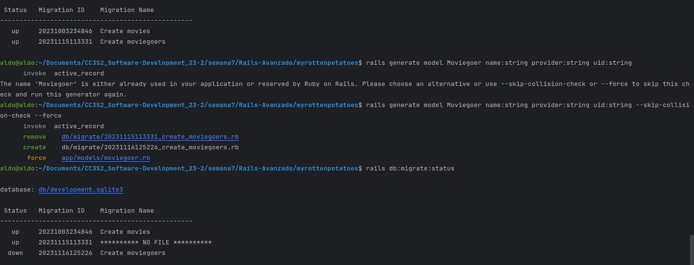

El archivo moviegoer.rb quedó prácticamente vacío. Lo llenamos con el código proporcionado en la actividad:


```ruby
# Edit app/models/moviegoer.rb to look like this:
class Moviegoer < ActiveRecord::Base
  def self.create_with_omniauth(auth)
    Moviegoer.create!(
      :provider => auth["provider"],
      :uid => auth["uid"],
      :name => auth["info"]["name"])
  end
end
```

Ahora toca aplicar la migración con el comando `rake db:migrate`, pero ocurre un error:

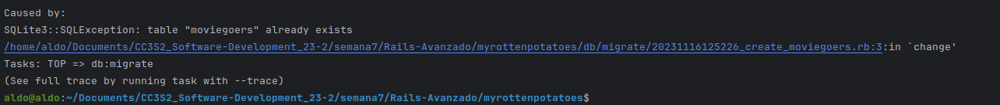

Dice que la tabla _moviegoers_ ya existe.


Lo que hacemos para evitar este conflicto es eliminar y volver a crear la base de datos con los siguientes comandos:

```bash
rails db:drop
rails db:create
```

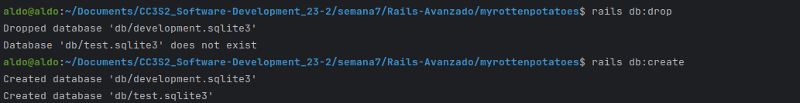

Cuando intentamos otra vez aplicar la migración con el comando `rake db:migrate`, ocurre un nuevo error:

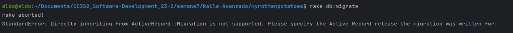

Al parecer, la versión de la migración del archivo _20231003234846_create_movies.rb_ se borró al eliminar y volver a crear la base de datos. Agregamos entre corchetes la versión 7.0:

```ruby
class CreateMovies < ActiveRecord::Migration[7.0]
```

Y ahora sí podemos ejectuar satisfactoriamente el comando para aplciar la migración:

```bash
rake db:migrate
```

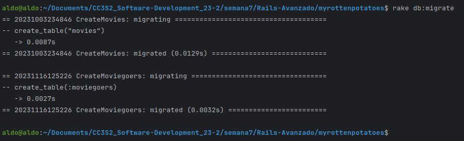

Arrancamos el servidor para ver en el navegador que ya no hay ningún título:

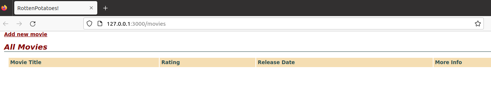

Esto se resuelve usando el siguiente comando:

```bash
rails db:seed
```

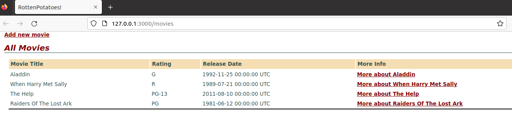

### Creación de una cuenta de desarrollador de Twitter

Vamos a crear una cuenta de desarrollador de Twitter porque es un proveedor de autenticación de usuarios mediante OAuth.

Para crear esta cuenta, nos piden describir todos los casos de uso de la API. Esto es lo que declaramos:

> Use Case: User Authentication with Twitter via OAuth

> Our application facilitates user authentication through Twitter using OAuth. We aim to enhance user experience by allowing individuals to log in to our platform seamlessly using their Twitter credentials. This authentication process grants us limited access to the user's Twitter account, allowing us to retrieve basic profile information and establish a secure connection between our application and Twitter.

> Key Points:
>  - User Login via Twitter
> - OAuth Authentication Flow
> - Access to Basic Profile Information
> - Security Measures
> - Logout and Session Management

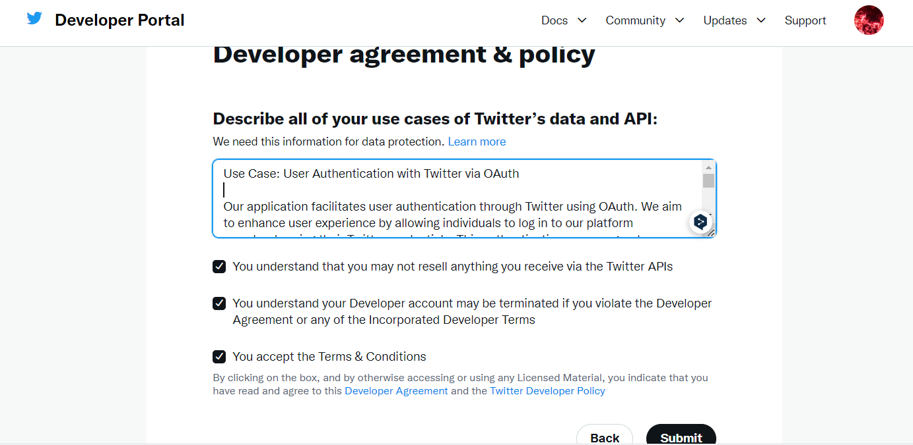

Entramos al portal del desarrollador y vemos que se ha creado un proyecto por defecto y una applicación en este proyecto. Esta app de Twitter tiene asociados las llaves y tokens que necesitamos para la aplicación que estamos desarrollando, así que le damos clic al símbolo de la llave azul.

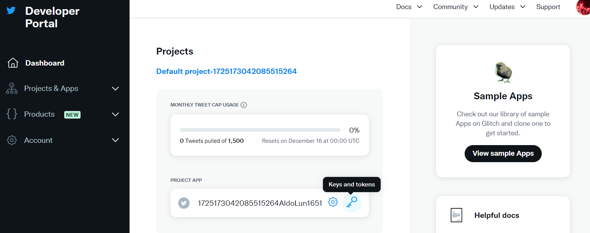

Aquí regeneramos la llave y el secreto API:

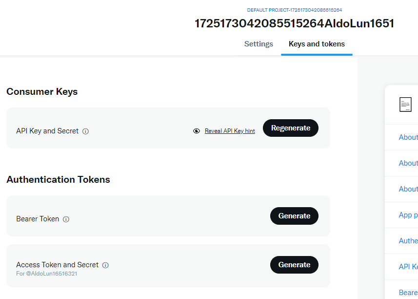

Y las copiamos:

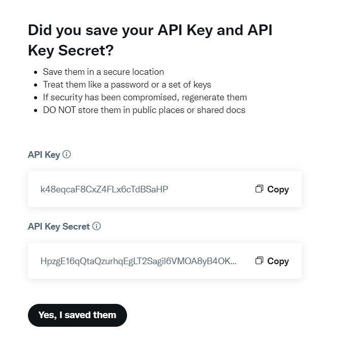

Estas irán en el archivo _omniauth.rb_ de nuestra aplicación:

```ruby
# Replace API_KEY and API_SECRET with the values you got from Twitter
Rails.application.config.middleware.use OmniAuth::Builder do
  provider :twitter, "API_KEY", "API_SECRET"
end
```


**Pregunta**

Pregunta: Debes tener cuidado para evitar crear una vulnerabilidad de seguridad. ¿Qué sucede si un atacante malintencionado crea un envío de formulario que intenta modificar params[:moviegoer][:uid] o params[:moviegoer][:provider] (campos que solo deben modificarse mediante la lógica de autenticación) publicando campos de formulario ocultos denominados params[moviegoer][uid] y así sucesivamente?.

**Respuesta**

